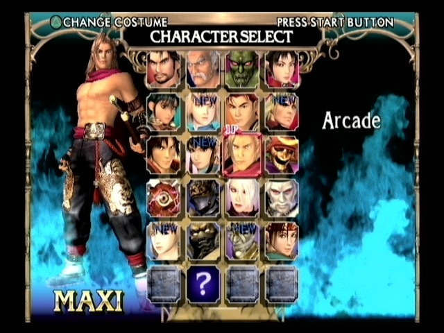
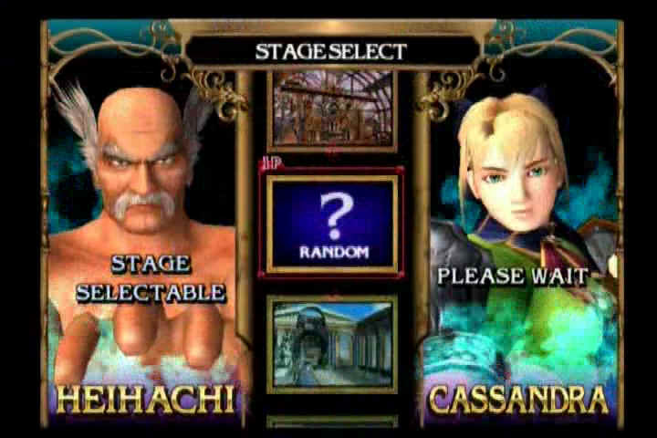
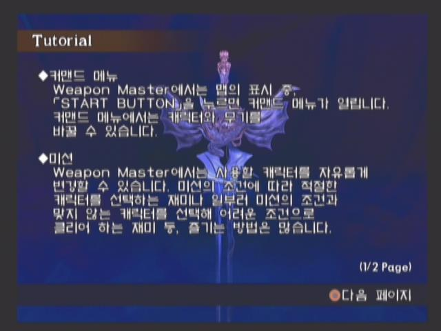
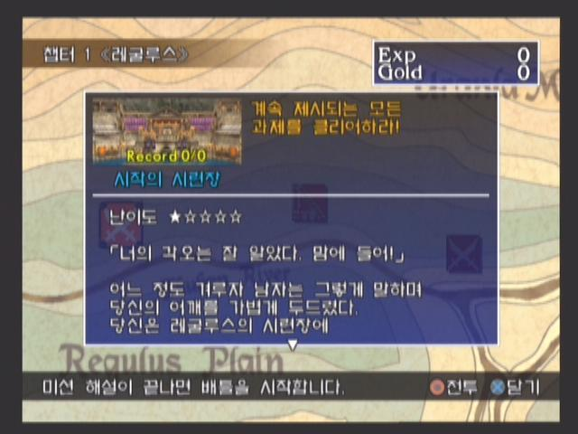
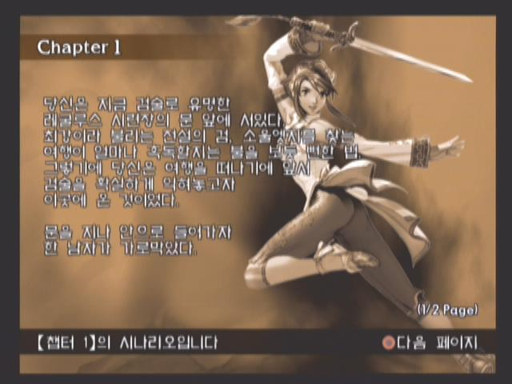
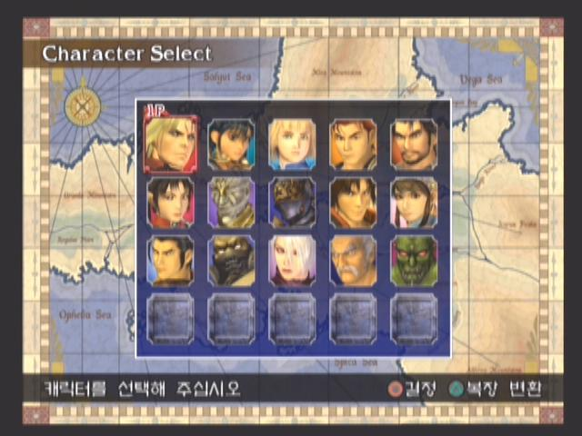

나는 격투 게임을 좋아한다. 어린 시절부터 수~ 많은 격투 게임을 했다.

호혈사 일족, 그루브 온 파이트, 뱀파이어 헌터, 다크 스토커즈, X-MEN, 마벨 슈퍼 히어로즈, 스트리트 파이터, 월드 히어로즈, 더블 드래곤, 천외마경 외전, 철권, DOA, 버파, 사립 저스티스 학원, 스타 글래디에이터 헥헥...

근데 이 중에서 중수라고 할 수 있는 게임은 스트리트 파이터, 뱀파이어 시리즈  밖에 없다.

내가 발컨이란걸 느낀 많은 게임들...흑흑

솔칼 시리즈도 오락실에서 하면 발리기 일쑤다.

근데 솔칼 시리지는 재밌다.

왜 재밌냐고 하면 솔칼은 그나마 콤보가 덜 중요한 게임이다.

내가 손이 느리다 뿐 아예 원하는 커맨드은 충분히 가능한데, 콤보가 덜 필요한 솔칼 시리즈의 특성상 종베기, 횡베기, 가드만 적절히 사용해도 충분히 승리할 수 있기 때문. (DOA 시리즈도 그런 의미에서 재밌게 할 수 있었다)

PS2판은 특별히 헤이하치가 등장한다.

XBOX판은 스폰, GC판은 링크가 출현한다.

솔칼2를 재밌게 즐긴 또 다른 요소는, 바로 웨폰 마스터 모드였다.

던젼을 탐사하듯 주어진 미션을 클리어 해나가는 모드인데, 이게 꽤나 느낌이 좋아서 로그 라이크류의 던젼 탐사나, RPG 게임의 던젼 탐사같은 느낌을 어느정도 받을 수 있다.

역시 남코는 컨텐츠를 잘 활용한다랄까?

사실 다른 격투 게임에 있는 그 어떤 모드보다 완성도 있는 보너스 모드가 아닐까 싶다.

남코 게임답게 철권에서 처럼 비슷한 무술(무기)를 사용하면서 살짝씩 다른 개성을 주는 캐릭터들도 많이 등장하는데,
그 중에서 난 지크프리드와 나이트메어를 아주 즐겨서 플레이하곤 했다.

현재 중고 시세로는 5000원~8000원 정도 하는거 같다.

솔칼 2는 그 몇배의 가치를 충분히 하는 게임이라 생각한다.

강력 추천!

평점 : ★★★★☆
