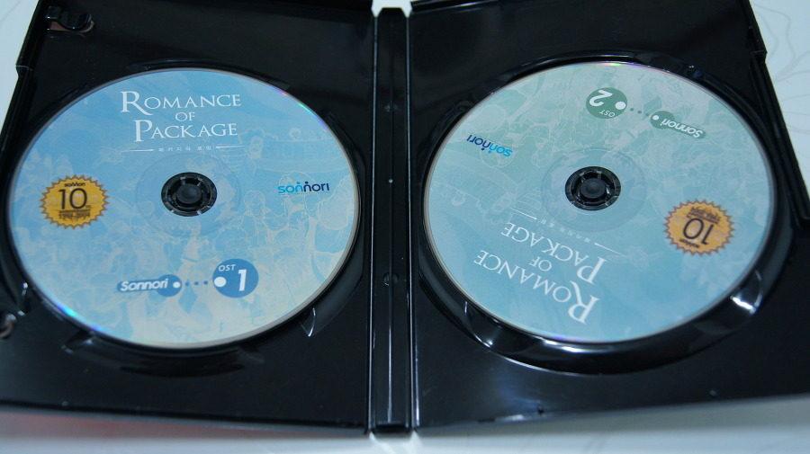
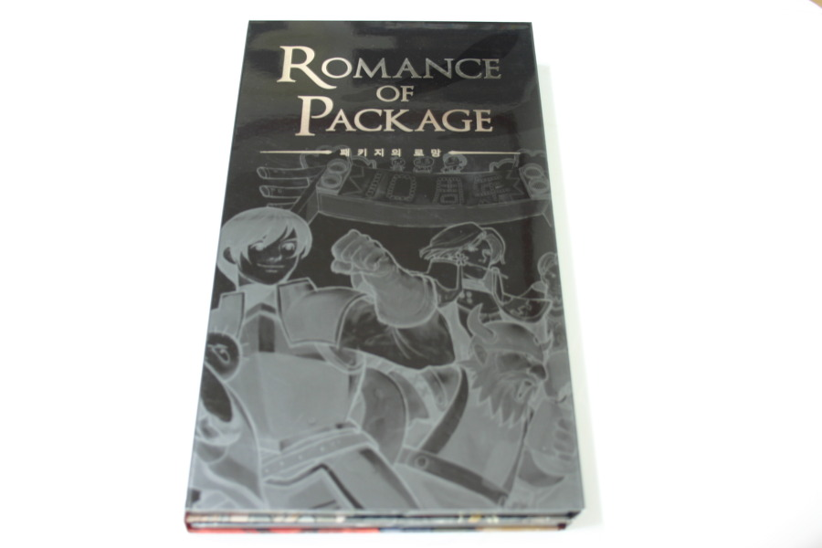

손노리의 여러 게임을 즐기며 성장기를 보내온 나에게 있어, 패키지의 로망은 반드시 구입해야 할 필구 게임에 가까웠다. 

고등학생 시절부터 모았던 PC 패키지 게임 수십개를 다 잃어버렸다.

그 중 포가튼 사가, 악튜러스, 화이트 데이도 있었는데...

그러다가 2004년에 손노리 10주년 기념 패키지의 로망 1000개 한정판이 판매됐다.

물론 그것도 샀었다. 학생 시절이라 부담스러운 금액이었지만 구매!

허나... 사회 생활 초창기에 돈 관리를 실수해서... 생활고(?)에 시달리다 각종 게임기 처분하면서 같이 처분했다.

그리고 다시 재판이 나왔고, CD/DVD 양장 케이스가 흰색인게 초회 한정판이고, 지금 사진에 나오는 검은색이 재판이다.

CD/DVD 디자인도 너~무 이쁘고, 손노리에서 발매한 모든 게임이 포함되어 있어 여러모로 소장 가치가 있다.

구성품은 CD/DVD 8장, OST2장, 손노리군 만화, 손노리 북클립, 손노리 AD Book 이다.

게임 구성은 어스토니시아 스토리, 다크 사이드 스토리, 포가튼 사가, 강철의 제국, 어스토니시아 스토리 R, 화이트 데이, 악튜러스가 포함되어있다

그러고보니 손노리 스폐셜 DVD가 있는데...저게 뭐가 들어있는 거더라?

지금은 재판마저 품절이 된 걸로 아는데, 패키지의 로망은 내가 가진 패키지 중에 가장 뽀대난다. 손노리 팬이시라면 꼭 하나 중고 장터에서라도 구입하시길 권장한다.

패키지의 로망판을 구입해놓고 막상 플레이는 그리 많이 하지 않았는데, 몇일전 포가튼 사가 리뷰 쓰면서 생각이 나서 포가튼 사가를 또 진행하고 있다.

아마 그 다음은 악튜러스가 될 듯?

자 여기부터 오픈케이스!

