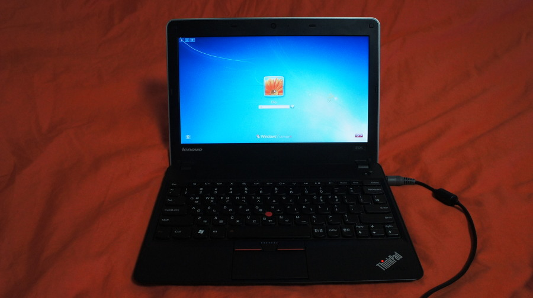
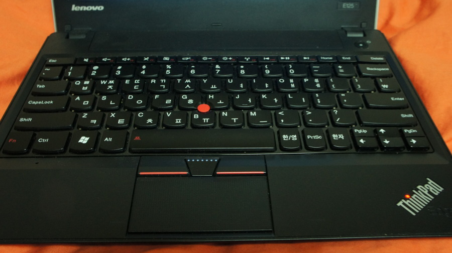
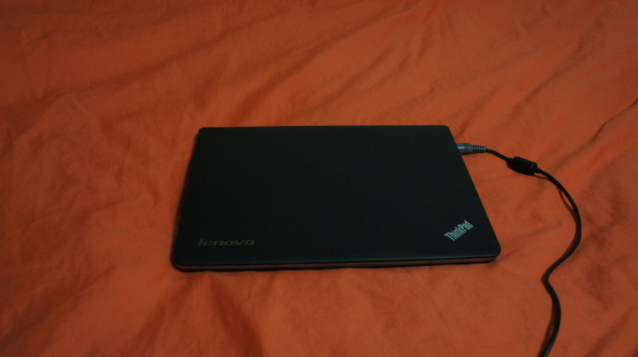

재작년 회사에서 사내 강연하고, 받은 10만원을 보태서 구입했던 노트북이다.

벌써 1년 넘게 썼다

내가 은근 샀다 팔았다 잘하는데, 무게도 적절하고 사양도 적절 (코딩하기엔 좀 사양이 딸린다. VS2010 컴파일 백만년..)

* [E125](http://prod.danawa.com/info/?pcode=1486243&cate1=860&cate2=869&cate3=10586&cate4=0)
하드웨어 스펙
  * CPU : AMD / APU E / E-450 (1.65GHz)
  * LCD : LED 백라이트 / 11.6인치 / 1366×768
  * HDD : 320GB
  * RAM : 2GB / DDR3
  * GPU : AMD(ATI) / 라데온 HD6320M / 시스템 메모리 공유
  * 무게 : 1.42Kg
  * 배터리 : 6cell
  * 통신 모듈 : 1Gbps 유선랜 / 802.11n 무선랜 / 블루투스 3.0
  * 출력 포트 : HDMI / D-SUB
  * 기타 :  웹캠 / USB 2.0 / 멀티 리더기 / 블록 키보드
  * 색상: 블랙

화면도 밝고, 배터리도 적절히 오래간다.

과거 IBM ThinkPAD X61 시절의 빨콩썼던 기억도 나서, ThinkPad를 썼더니 터치 패드도 괜찮고 아주 맘에든다.

키보드 레이아웃도 내가 쓰기엔 적절했으며, 내가 젤 맘에든건 ThinkPad 로고 위에 빨간 불.

별거 아닌 디테일이긴한데 보급형 모델까지 이렇게 신경쓴게 맘에 들었다. (현재 33만원이지만 당시에도 42만원 정도 밖에 안한 저가형 모델이었으므로)

블록 키보드도 은근히 키감이 좋고, 키간 간격이 그리 좁지 않아서 더더욱 맘에 들었다고 할 수 있다.

지금은 후속 기종도 많이 나온 시점에서… 레노버 노트북이 중저가 노트북 계열에선 괜찮은 선택이라는 생각이 든다.

