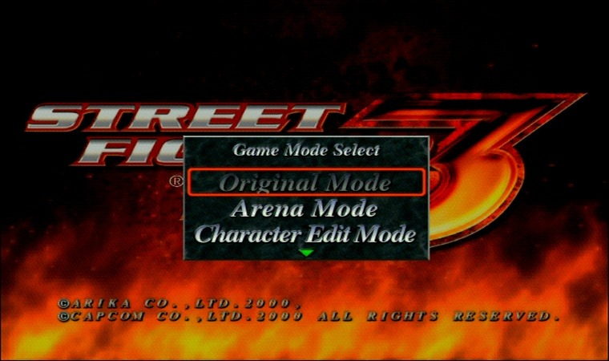
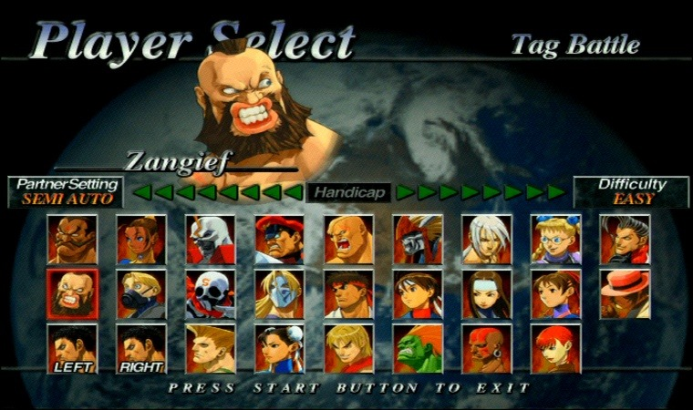
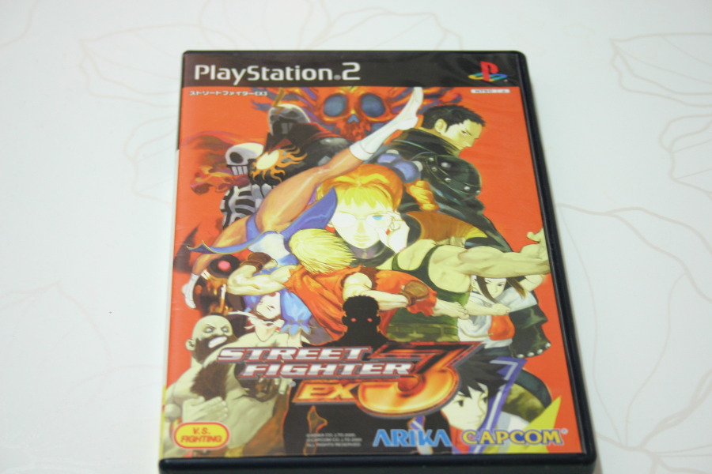
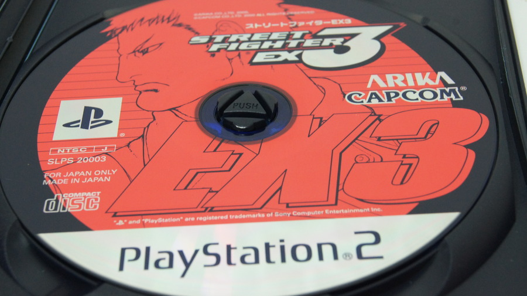

아케이드로 발매되었던 3D 스트리트 파이터 시리즈의 최신(?)판. 

스트리트 파이터 EX3다.

EX1, Ex Plus, EX2, Ex2 Plus까진 아케이드 전용으로 발매되고 이식 되었는데, Ex3는 PS3전용으로 발매된 게임이다.

스트리트 파이터의 아버지 아키라씨가 세운 아리카에서 만든 게임이라 그런지 더더욱 스트리트 파이터 2 스러운 느낌을 잘 살렸다랄까?

스트리트 파이터4도 3D 게임이지만, 축 하나를 사용하지 않아 2D게임이지만, 이 게임은 리얼 3D(?) 게임 답게 축 세개를 다 사용한다. 즉 횡이동이 있단 의미다.

제로 시리즈의 제로 콤보가 평타 기반의 콤보였다치면, EX 시리즈는 슈퍼 캔슬이라는 필살기 + 슈퍼 콤보로 이어지는 극단적인 캔슬이 가능한 시스템이다.

실제로 밸런스에 딱히 문제도 없는게 데미지가 어마어마하진 않다. 그저 게이지를 조금 더 소모해 안정적인 추가 데미지를 주는 정도의 느낌?

길티기어 시리즈가 콤보수가 어마어마하지만 데미지 보정을 통해 콤보수 대비 데미지가 크지 않은 것과 비슷한 맥락이라 볼 수 있다.

스트리트 파이터를 해본 유저라면 누구나 쉽게 적응 할 수 있고, 위에서 설명한 대로 콤보 시스템이 좀 더 화끈해서 재밌게 즐긴 게임.

