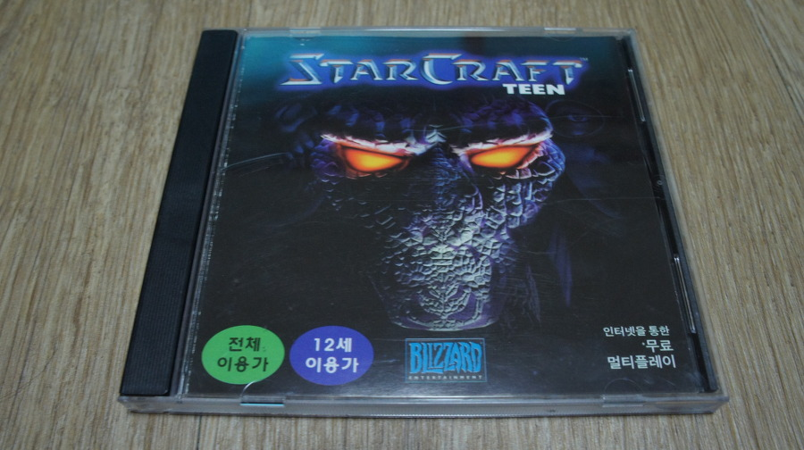
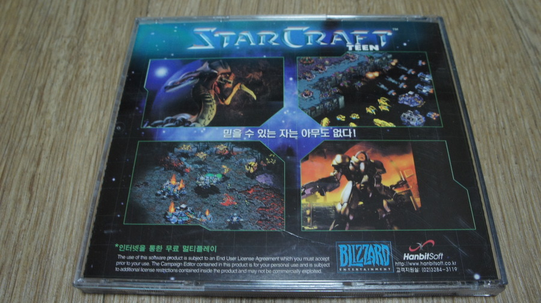
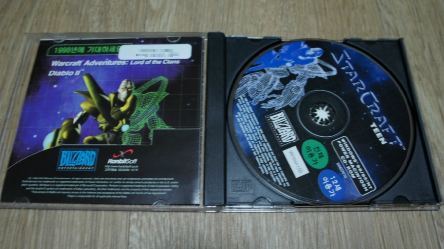
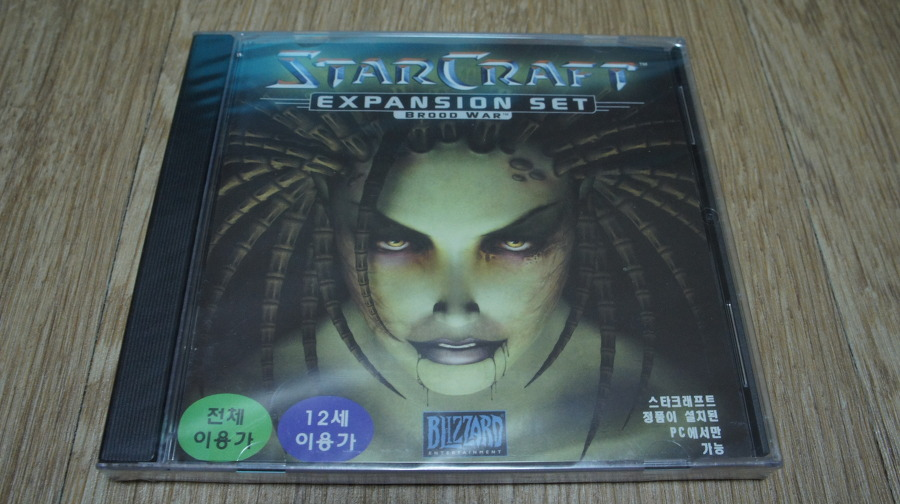
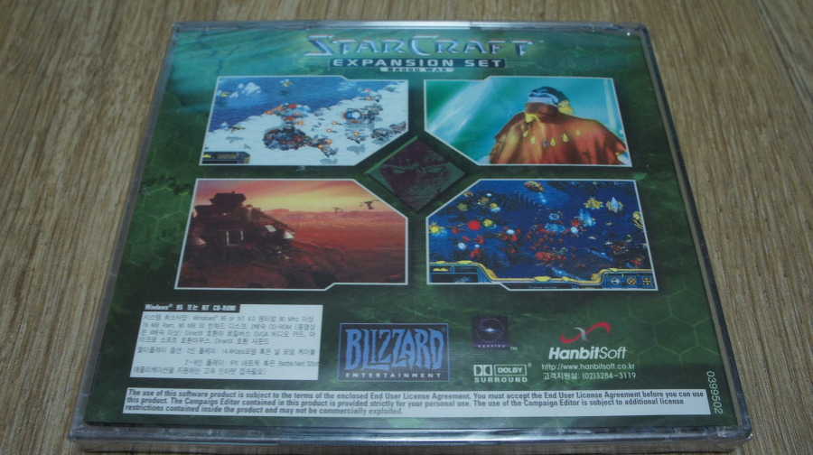
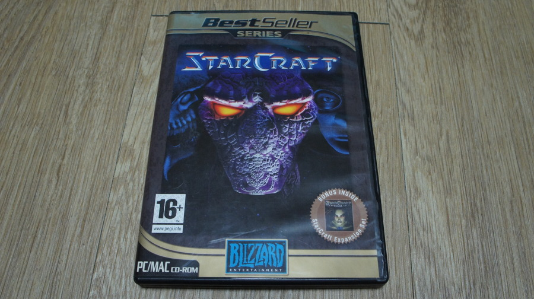
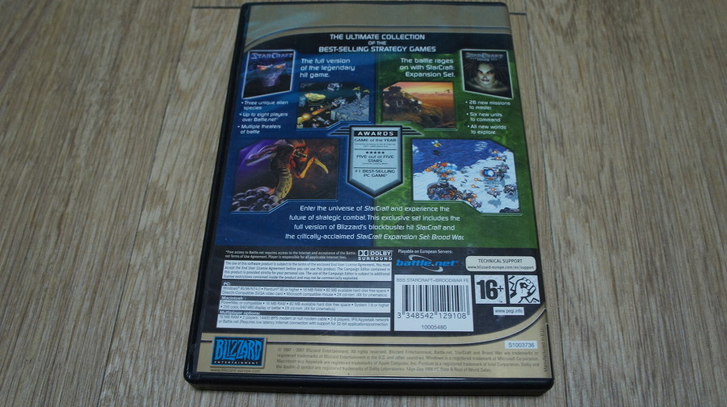
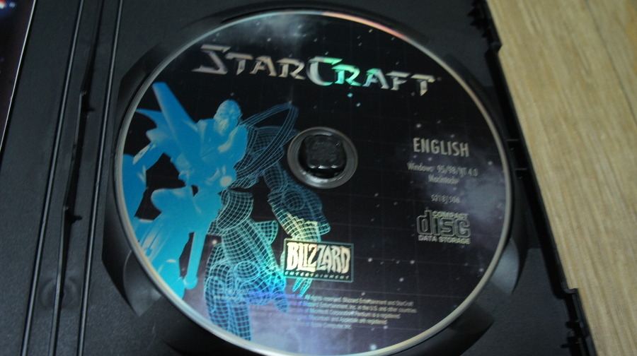
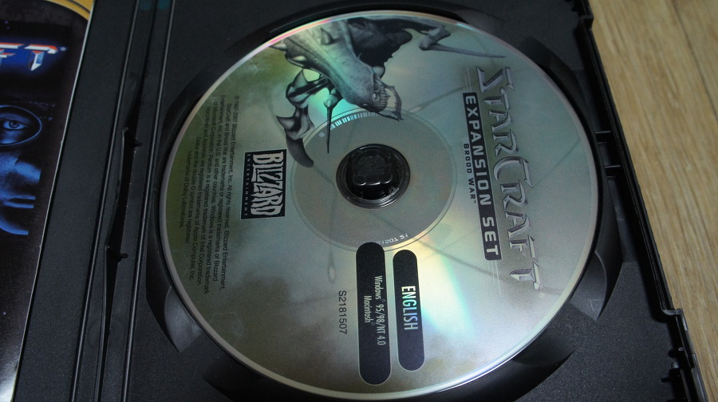

미친듯이 했던 몇안되는 게임 중 하나. 대학생때 심심하면 당구장, 호프, 또 PC방을 갔는데 그 중 PC방에서 단골 게임이었다.

대학 축제때도 심심치 않게 대회가 열리곤 했고, 밥값 내기 술값 내기로 자주 즐기곤했다.

물론 그 전인 중학생때부터 PC방의 중흥기를 이끌었던 게임이기도 했고.

내가 굳이 설명하지 않아도 되는 게임을 굳이 얘기하는 이유는, 물건 정리하다보니 스타가 패키지가 2개나 있더라. 북미 베스트판까지. 군단의 심장 베타 테스트 해보면서 생각이 많이 나고 비교도 많이 되더라. 그래서 군단의 심장에 대해 글 쓰기 전에 정리하는 느낌이라 할 수 있다.

스타1의 황금기는 10년 넘게 지속됐다고 볼 수 있는데, 그 원동력에는 프로 리그와 스타리그가 있었다.  

4대 천왕 (임요환, 이윤열, 박정석, 홍진호) 시기에는 스타보는 재미로 프로리그, 스타리그로 힘든 회사 생활을 견디곤 했으니 말이다.

나는 박정석 선수를 가장 좋아했는데,  컨트롤도 매우 좋으시지만 손이 좀 느린 편인 나로써는 생산에만 집중한 뒤 생산된 물량을 기반으로 밀어붙여 힘으로 뚫는 플레이를 좋아했는데, 그게 한계가 좀 있어 초반에 승부를 보는게 참 어려웠었다.

그런데 당시 박정석 선수는 입구 뚫기의 여러가지 테크닉 (리버 동반, 질럿 떨구기, 셔틀로 본진 흔들기, 발업 질럿으로 앞마당 타이밍에 뚫기 등)을 따라하며 많은 것을 느낄 수 있게 해준 선수여서 

현재는 LOL 나진 E-Empires 팀의 감독을 하고 계신 박정석 선수는 진정한 프로의 귀감이었다랄까?

과거 한빛 스타즈 소속일 때 부터, KTF에서 활약하는 내내 박정석 선수는 팀플이면 팀플, 개인전이면 개인전, 스타리그면 스타리그 모두 멋진 플레이를 보여주었다.

가장 기억에 남는 경기는 2002 Sky배 결승에서 임요환 선수와의 결승전. 가을의 전설을 만든 박정석 선수는 소수 종족 프로토스의 영웅으로 기억되기에 충분히 멋진 경기를 보여주었다.

현재는 나진 E-Empire 감독으로써 팀을 잘 이끌고 계신데, 팀의 좋은 성적의 원동력에는 박정석 감독의 곧은 마인드가 영향을 준게 아닌가 싶다.

여튼 스타의 빠른 템포와 초반/중반/후반으로 넘어가기 까지 지루한 게임은 흔치 않다. 정식 배틀넷에선 좀 느리지만, UDP 플레이에서는 반응성에 따른 컨트롤의 묘를 살릴 수 있는 게임이라 이렇게 오래 장수한게 아닌가 싶다.

너무 단점 지적을 안했는데... 역사의 큰 한획을 그었고, 그 역사가 오랫동안 큰 밸런스 패치 없이 있을 수 있었단 점만으로도 그 가치를 인정해야 되므로... 칭찬으로 끝까지 마무리 하련다.

