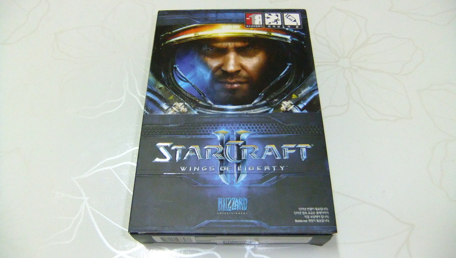
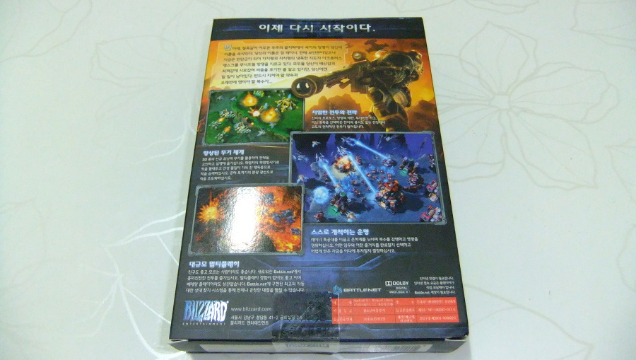
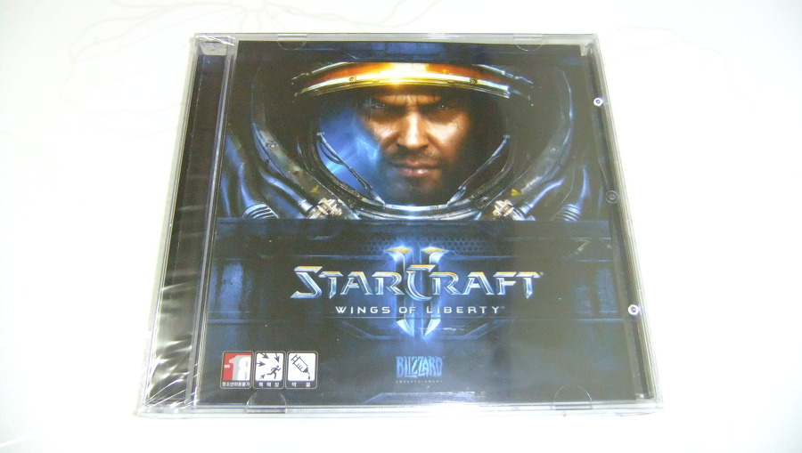

디지털 다운로드 판이 있음에도 패키지를 구입했던 또 다른 게임.

스타크래프트2다.

오픈 베타를 너무 길게해 시나리오 모드를 클리어한 사람이 넘쳐났다.

게다가 오픈 베타 기간이 길어 할만큼 한 사람도 많았는데 발매 가격도 69900원으로 너무 비싸서, 안산 사람이 많았다. (나 포함. 나도 39900원으로 가격 인하하고 나서 샀다)

오픈 베타 시기에는 골드까지 갔었고, 할인 후 구매하고 나서는 여러 글들에서 얘기한대로 2:2 플래티넘, 3:3, 4:4 다이아 까지 갔었다.

나름 열심히 했는데, 안하게 된 계기는 LOL 때문...

스타2가 딱히 재미가 없다기보다는, 스타1.5의 느낌이 났다는게 좀 아쉬웠다랄까?

좀 더 색다른 경험을 원하는 사람들에겐 부족하지 않았나 싶다.

사실 단점을 지적하자면 꼽기 어려운 게임인데, 그렇다고 장점을 꼽자면 그것도 그다지 없다.

얼마전 군단의 심장 1차 클베에 뽑혔다. (아마 배틀넷 계정에 블리자드 모든 게임이 등록되어 있는 것이 뽑힌 원동력이지 않았나 싶음) 

군단의 심장이 얼마나 바꼈을지는 모르겠으나, 자유의 날개보다 더 나은 경험을 줄거란건 믿어 의심치 않는다.

다만 LOL에게 내준 국민 게임의 입지를 다시 찾아오려면, 훨씬 더 매력적이어야 하지 않을까 싶다. 군단의 심장에 대한 글은 다른 포스팅에서 더 자세히 쓰겠음.

