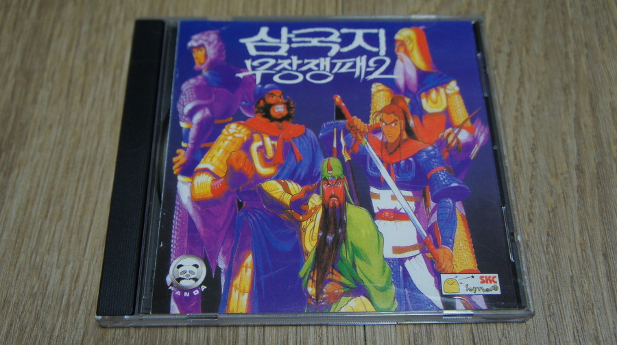
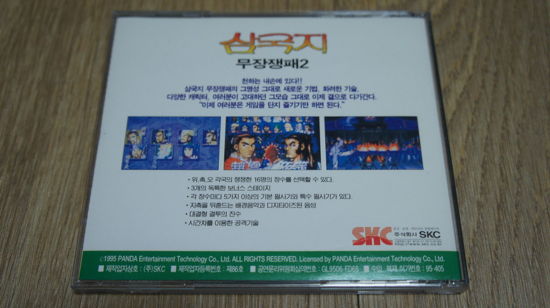
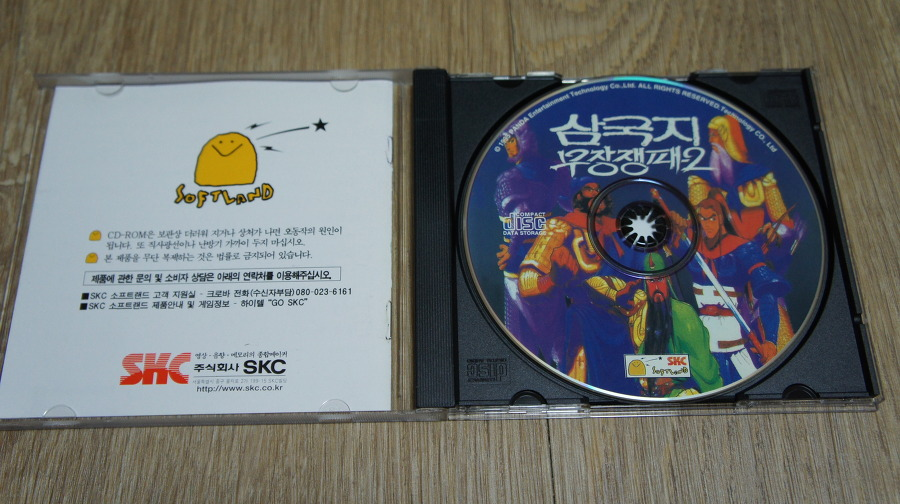
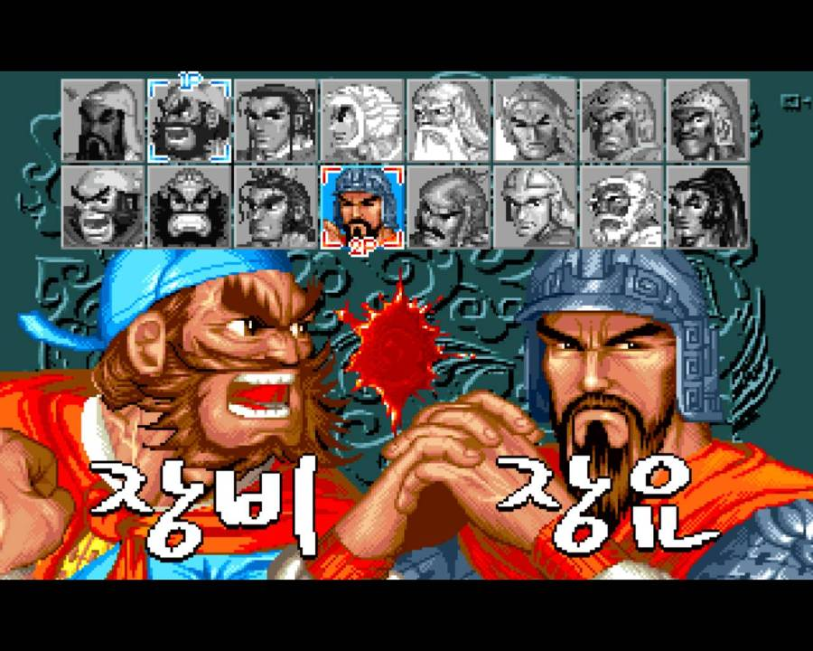
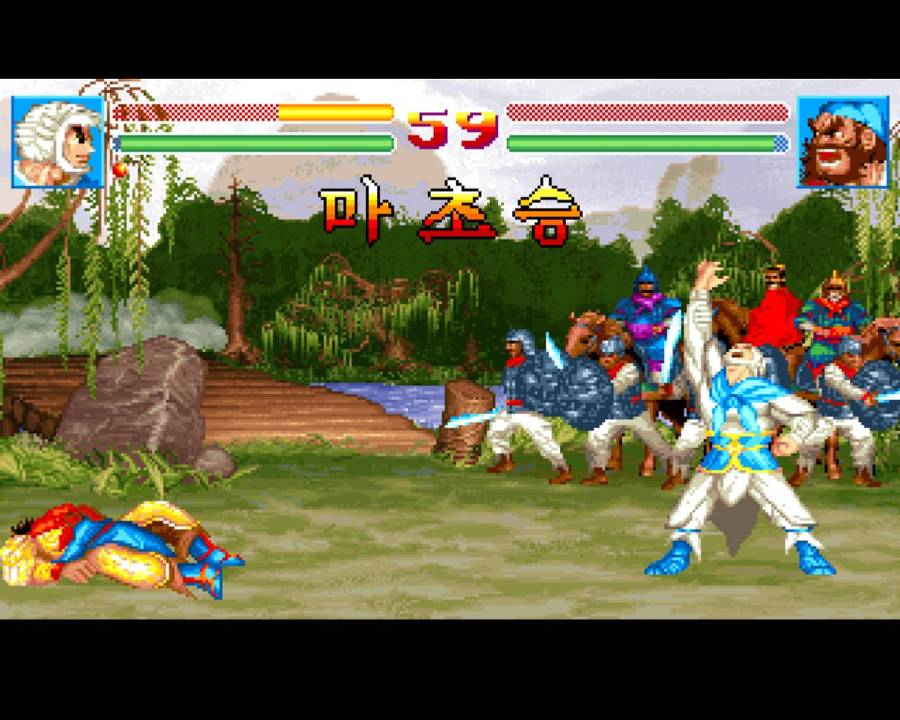
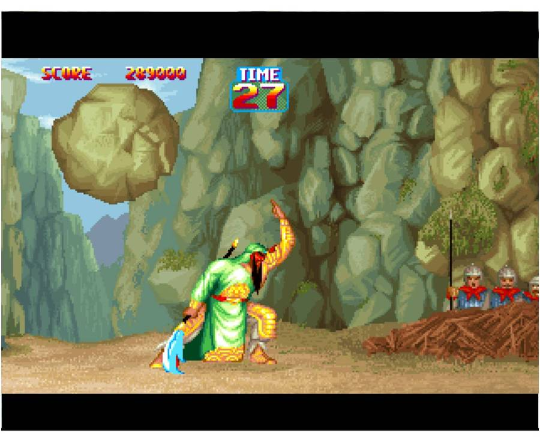

언젠가 용산에서 쥬얼 CD로 구한 삼국지 무장쟁패2다.

1편에 비해 압도적으로 좋은 퀄리티로 나와 큰 인기를 끌었다. 

이 게임의 특이한 점은 조작감인데, 순차 입력 타이밍이 미묘하다. 적응되면 괜찮긴하지만, 여타 격투 게임을 키보드로 할때와는 조금 다른 입력 감각을 요한다.

게임 모드는 일반 대결 모드인 무장쟁패, 1:1 지정 대전인 쌍방대전. 그리고 이 게임의 핵심 모드인 통일천하 모드가 있다.

촉, 위, 오, 그리고 여포 세력을 선택 할 수 있는데, 이 세력들은 기본적으로 장수 한명이 출정해서 대전하는 모드다.

위, 촉, 오가 각각 5명, 여포는 혼자. 이렇게 해서 16명의 장수가 등장하는데, 여포 세력은 혼자인 만큼 혼자 다 이겨야한다.

딱히 문제는 없었던 이유는 애초에 여포를 고른다는 것 자체가 자체적으로 높은 난이도에 대한 도전이라 볼 수 있는 느낌도 있었다랄까?

캐릭터마다 기술도 다양하고, 특색도 있어서 플레이하는 맛도 있었다.

당시 열악했던 PC 대전 액션 게임 시장에 한줄기 빛이었다. 키보드 하나로 2인용도 지원해서 쌍방 대전을 즐길 수 있었는데, 오락실에서 즐기던 격투 게임들에 비해 한없이 초라하긴했지만, 동시 입력이 안되는 키보드 사용자가 많았던 것 까지 감안한 (확신은 안듭니다만;) 위에서 말한 오묘한 순차 입력 타이밍으로 꽤나 원활하게 즐길 수 있었던 게임이다.

