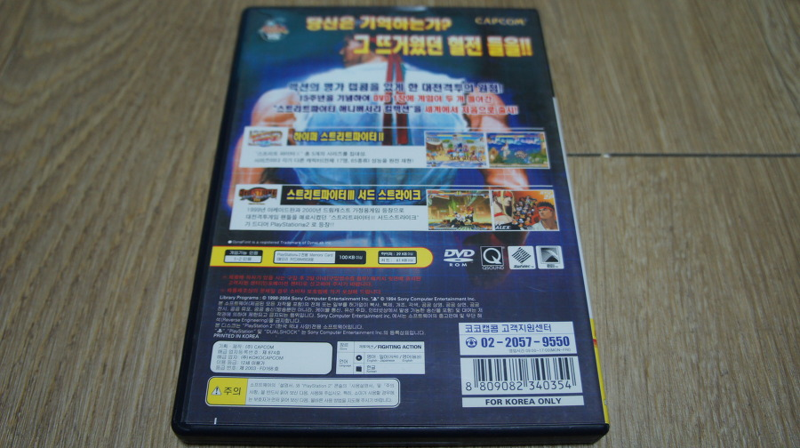

PS2용으로 발매된 스파 15주년 헌정판.

Street Fighter Anniversary Collection (이하 스파 애니) 이다.

구성은 1-dvd에 Hyper Street Fighter 2 (이하 하이퍼 스파2) 와, Street Figheter 3 3rd strike (이하 스파3 써드) 합본팩으로 구성되었있는데, Hyper Street Fighter 2는 Street Fighter 2 ~ Super Street Fighter 2 X 까지의 캐릭터를 선택해서 플레이 할 수 있는 Hybrid 버전이다.

스파4는 대중적인 성공을 거뒀지만, 스파3 써드도 굉장히 잘 만든 게임이고 재밌는 게임인데, 국내에서는 처참한 흥행 참패로 오락실에서 찾아보기도 어려웠다는 현실. CPS3 기판이 비싸서였다고하는데, 실제로 위저드도 당시 여러 오락실 중에서 딱 한번 봤다.

스파3는 이전 시리즈보다 조금 더 하드코어한 게임이 되어버렸는데, 그 원인중 하나가 블럭킹 시스템으로 백열각을 모두 막아내는 동영상마저 돌았을 만큼 실력 의존형 시스템이 존재했지만 (나는 매우 불만. 쓰기 어렵다고!!) 전반적인 완성도가 뛰어난 게임이었다.

내가 꼽는 스트리트 파이터 시리즈 베스트가 몇 작품 있는데, 스트리트 파이터 2 터보, 스트리트 파이터 제로3, 스파 3 써드, 슈퍼 스파4 AE다.

그 중 가장 대중적인 성공에 거리가 먼 작품이 스파3라는 점이 아쉽긴하지만, 나는 아직도 종종 플레이하곤 한다.

이 작품이 나온지도 벌써 10년여가 지났는데, 또 다른 스트리트 파이터 컬렉션이 안나오나 기다려봤으나 아쉽게도 스파 애니와 같은 합본팩은 나오지 않았다.

올해나 내년에 스파 애니 처럼 기념비스러운 게임이 나왔으면 하는 소망을 가져본다.

