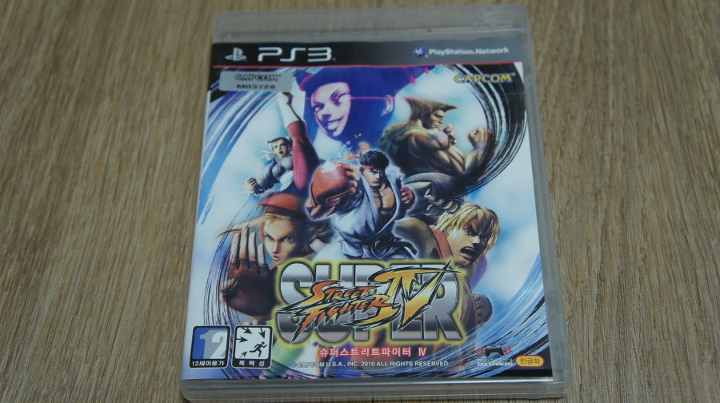
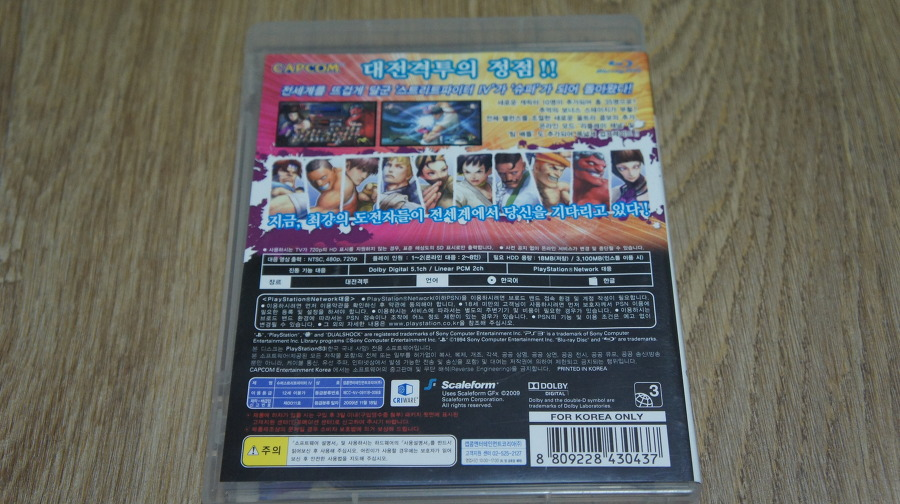
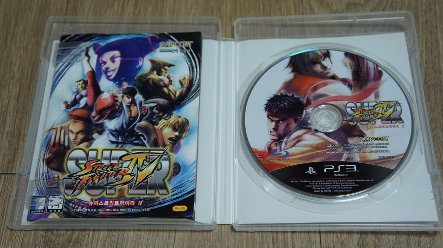

국내에서도 매진행진을 열었던 스트리트 파이터4의 업그레이드 버전.

슈퍼 스트리트 파이터 4다.

캐릭터도 아주 많이 추가 되었고 언락 구조였던 스트리트 파이터4와는 달리 바로 사용할 수 있어 좀 더 편리하다.

스트리트 파이터2에서 슈퍼 스트리트 파이터2로 업그레이드 된건 꽤나 긴 시간이 지난 후였고, 전체적으로 큰 변화가 가해졌다면, 슈퍼 스트리트 파이터4는 캐릭터 추가 및 마이너 업그레이드 버전 정도라고 볼 수 있다.

추가된 캐릭터들은 T-Hawk, 디제이, 코디, 가이, 아돈 등의 스파 제로 캐릭터들과 마코토 등의 스파3 캐릭터, 최초의 한국인 오리지널 캐릭터 주리까지 추가되어 아주 많은 캐릭터 선택 폭을 갖췄다.

좀 아쉬운건 캐릭터 추가가 주였던 마이너 업그레이드 팩을 DLC로 팔았고, 또 슈퍼 스파4 AE라는 이름으로 발매했다는 점이다.

사실 추가 캐릭터중에 맘에 드는 캐릭터가 없어서 슈퍼 스파4 AE를 급하게 구하진 않았는데, 그나마 다행인 것은 업그레이드를 하면 슈퍼 스파4와 슈퍼 스파4 AE간의 대전이 가능한 점이었다.

워낙에 스트리트 파이터4가 격투게임 쇠퇴기에 구세주처럼 큰 인기를 누렸던 작품이다보니, 게임성에서는 불만이 없었다.

스파4도 사실 격투 게임들 중 난입 가능한 점이나 여러가지로 완성도가 높은 게임이었지만, 조금 더 편해지고 발전한 작품인지라 스파4 팬이라면 자연스레 구매하게 될 슈퍼 스파4다.

