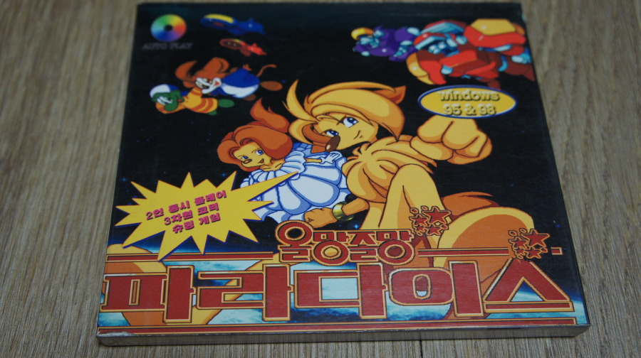
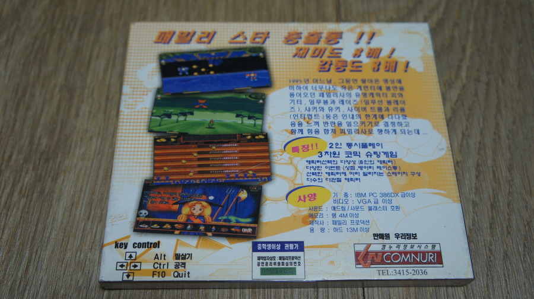
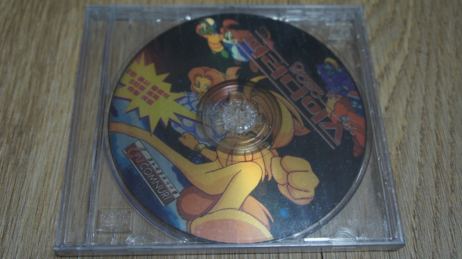

샤키, 피와 기티 등... 패밀리 스타(?) 총 출동 게임입니다. 패밀리 프로덕션의 캐릭터가 다수 출연한다.

이것도 용산에서 매장 떨이시 업어온 고전 게임중 하나였다. 쥬얼이긴했지만...

슈팅 게임으로서 갖춰야 될 기본적인 재미는 다 갖추고 있고, 스테이지 구성도 다양하게 잘 꾸며져 있어 꽤나 괜찮은 올스타 게임(?)이라고 할 수 있다.

중간 중간 샵도 있어, 아이템을 구매할 수도 있어 잔재미가 많은 게임이라고 할 수 있다.

은근 기억하시는 분들이 많았다.

저도 피와기티를 꽤나 재밌게 했어서, 친구는 샤키를 재밌게했고, 둘이 모여서 올망졸망 파라다이스도 즐겼던 기억이 난다.

슈팅 게임중에선 섹시 파라디우스 만큼이나 재밌었다. (그날이 오면이나, 시발 원숭이의 모험도 괜찮았다)

