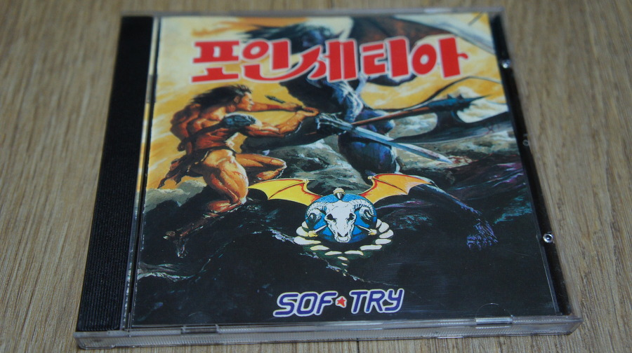
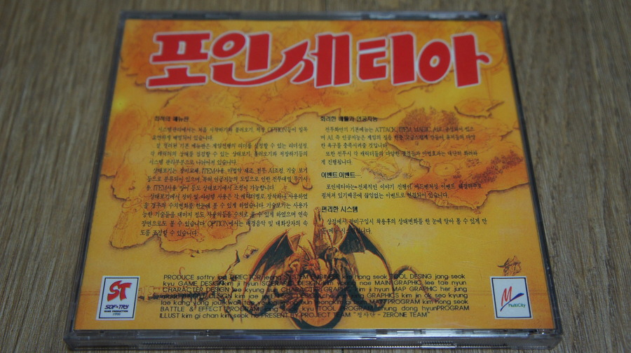
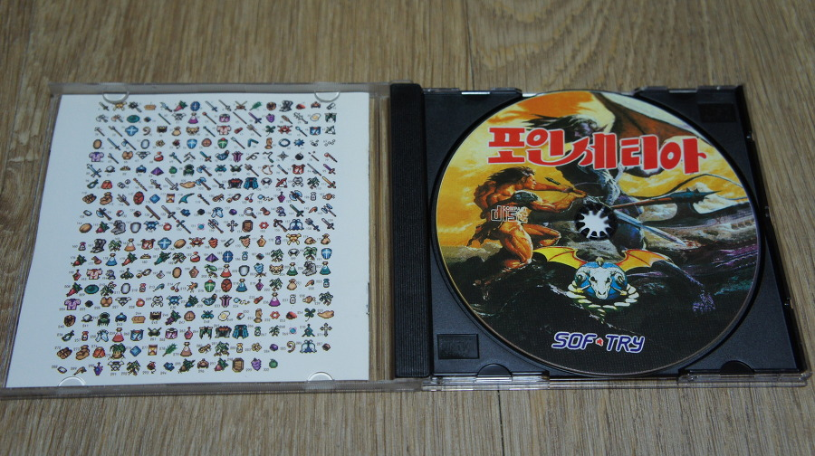

이것도 용산 돌아다니다가 쥬얼로 팔길래 구입한 게임이다.

소프트라이라는 이름을 90년대 초중반 게이머라면 기억할텐데, 맞다. 손노리의 어스토니시아 스토리팀이 있던 팀이 바로 소프트라이다.

실제로 게임 분위기도 매우 비슷하고.

사실 일러스트만 봐서는 황금 도끼가 더 연상되긴하지만... 실제로 플레이해보면 어스토니시아 스토리의 영향을 크게 받은 게임이란 것을 알 수 있다.

기본적으로 일본식 RPG (주로 파판이나 드퀘)의 영향을 받은 한국식 RPG였으며, 나중에 파판8이었나? 그쯤에서 채용됐던 주인공과 함께하는 몬스터 레벨업 시스템의 쓴 게임이다.

또한 약초 조합 시스템이 나름 쏠쏠한 재미를 줬다.

허나 RPG 본연의 재미에서는 조금 모자른 감이 있으며, 난이도가 높은편에 속했고 (위에서 설명한대로 레벨 노가다가 의미가 없음) 세이브 포인트가 없다는 점 때문에 나를 비롯한 라이트 유저들을 좀 더 당혹케 했다.

사실 생각해보면 진 여신전생 시리즈가 더 어려운데.... 즐긴 시기의 차이 때문일까?

여하튼 그 당시 국내에서 얼마나 RPG붐이었는지를 알 수 있는 게임중에 하나이며 (어스토니시아 스토리, 창세기전, 프로토코스, 망국전기, 레이디안 등과 함께), 나름 어스토를 재밌게 즐긴 유저들 사이에서 화재가 된 작품이다.

