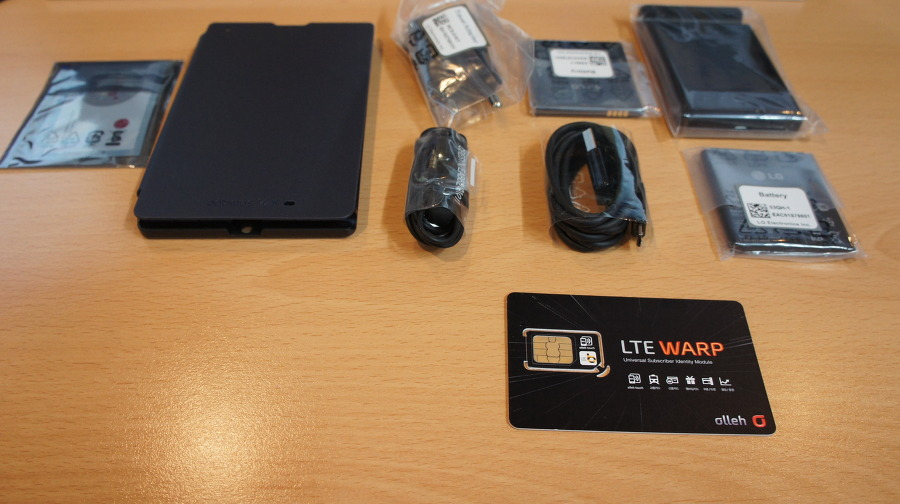
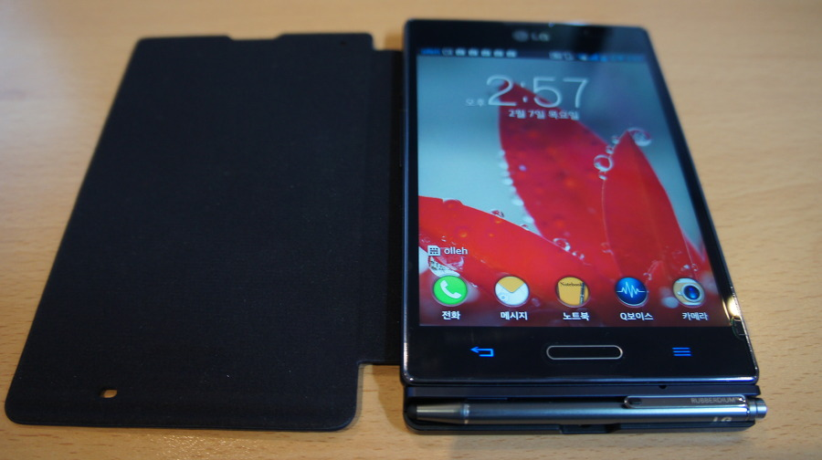

VEGA LTE가 또 말썽이다. 

한달에 한번 공장 초기화를 해줘야한다니?

게다가 AS센터에선 딱히 대책이 없음. 무한 재부팅이 왠말이요? 그것도 발매 당시 주력 모델이었던 VEGA LTE가 말이다. 

VEGA NO6가 매우 솔깃한 스펙이었음에도 다 무시하고 옵티머스 뷰2, 갤럭시 S3, 갤럭시 노트2 사이에서 고민하다 누나가 먼저 산 옵티머스 뷰2를 실제로 보고 난 뒤 옵티머스 뷰2로 급 결정했다.

유심이랑 박스 구성이다.

 박스가 심플한게 맘에 들더라.
 
 본체와 펜이 세팅된 모습.악세사리 패키지 케이스다.
 
 흰색으로 전반적으로 아주 깔끔하지 않은가?
 
 폰을 제외한 악세사리 구성품의 모습입니다.여닫이 케이스, 스탠드 형식으로 사용 가능한 배터리 충전기...등 구성이 나쁘지 않다.
 
 배터리도 착탈식인 만큼 두개가 들어있고요. 다만, 이어폰의 성능이 그다지 좋지 못하더라. 아니 그보다 핸드폰 자체의 음질이 그다지 만족스러운 수준이 아니다. NWZ-X1050을 쓰고 있어서 그런걸까?
 
 울트라쏜 PRO-900이 아닌 NWZ-X1050 번들로 듣는 것보다도 한참 못하다랄까?
 
 결국 음악은 평소처럼 MP3를 따로 들고 다니게 될듯 싶다.기
 

사실 블랙 사려 한 건 아닌데 랜덤 발송으로 블랙이 왔다.

본체에 내장되지 않는 팬도 내장되고, 나름 괜찮긴 하지만 카드 한두장이랑, 적은 현금수납이 가능한 지갑형식의 케이스로 곧 바꾸지 않을까 싶다.

전반적으로 액정도 아주 크고, 4:3 비율도 맘에 든다.

해상도는 1024x768로 좀 적지만 듀얼코어인 CPU도 지급 구입하기에 애매하지 않을까 했지만 워낙에 가격도 저렴해진데다가, 5인치 4:3인치 액정, 2GB 램 등 스펙상 불만이 없을 수준이어서 괜찮았다.

실제로 젤리빈의 덕인지 기기자체가 잘빠진건지 불편함없는 세팅 과정, 특히나 내부 저장소 크기도 넉넉한게 너무 맘에 드는 상태다.

가장 최근에 쓴 LG폰이 샤인이었는데, 이번 옵티머스 뷰2가 6개월, 1년 후에도 만족스럽다면 다음 폰도 LG 계열로 구입하게 될거 같다.