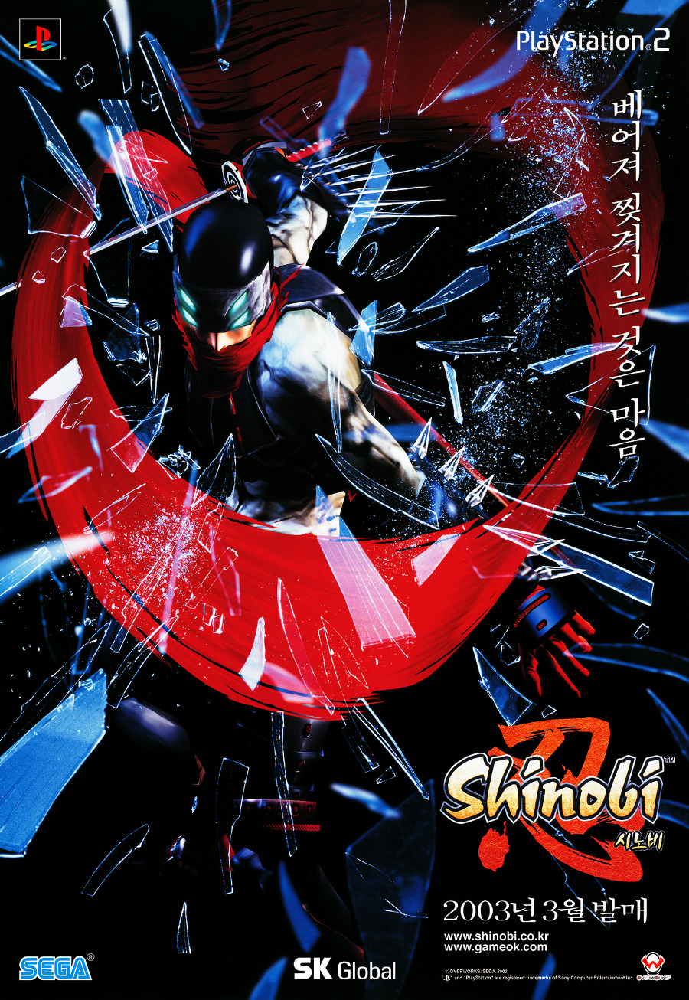

이건 쥬얼 아니고 패키지로 샀던 마그나 카르타입니다. 박스가커서 이사 과정에서 버렸다.

마그나 카르타가 당시 뭔지 잘 몰랐다가 대헌장이라는 뜻이란걸 알고, 게임과 연관이 없는 단어인데 왜 이걸로 지었을지 한참을 고민했던 기억이 나네요.

당시 패키지 게임들 중 버그가 적은 게임은 별로 없었지만, 포가튼 사가와 함께 유독 심한편이다보니 버그로 악명을 높이 산 게임이죠. 

전량 리콜 사태가 있었던 시기... 구입하셨던 담임 선생님이 분노와 함께 한참을 악평을 늘어놓으셨던 기억이 새록 새록하네요.

어쨋거나 게임 자체는 김형태씨의 일러스트가 멋졌지만, 당시의 기술적 한계상 인게임은 너무나 큰 괴리가 있었으며...

나쁘지 않은 게임이었으나, 워낙에 창세기전 팬들의 기대치가 높았고, 버그도 많았던 점이 아쉬웠던 게임이었습니다.

이후 PS2 버전 마그나카르타 - 진홍의 성흔은 기나긴 로딩으로 그다지 좋은 평가를 받지 못했지만, XBOX360으로 발매된 마그나 카르타2는 꽤나 좋은 평가를 받은 수작이었습니다.

아마 국내 콘솔 게임 시장 규모 등을 고려해봤을 때, 마그나 카르타3가 나오긴 쉽지 않을거 같지만... 한국식 RPG 계보의 명맥을 유지하는 몇안되는 게임이 명맥을 유지하길 기대하고있네요.

