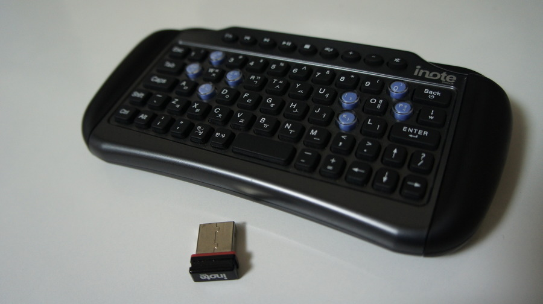
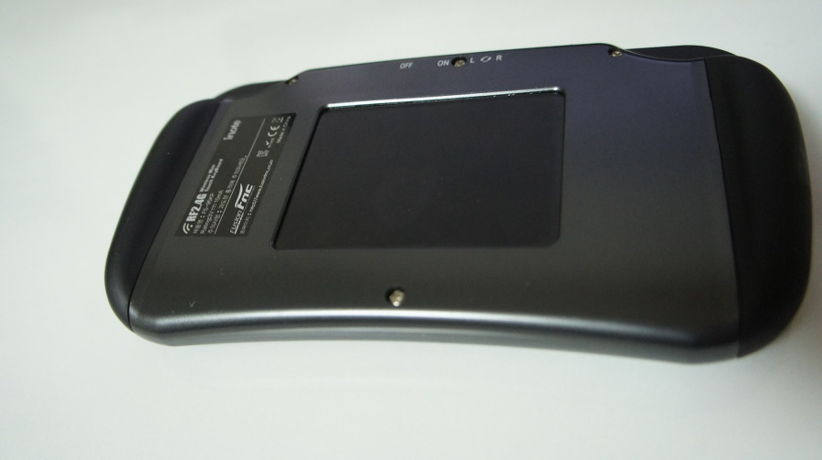

작년 봄쯤에 구입했던, USB 무선 키보드 아이노트 FS-95KP다.

[퓨전에프앤씨 FS-95KP](http://shopping.naver.com/detail/detail.nhn?nv_mid=6176674534&cat_id=40002649&frm=NVSHSRC&query=%EC%95%84%EC%9D%B4%EB%85%B8%ED%8A%B8+%EB%AF%B8%EB%8B%88&section=price)

뒷면이 터치패드 방식으로, 나름 편할줄 알고 구입했는데 차라리 풀사이즈 키보드 방식을 구입하는게 낫지 않았을까 싶다.

크기도 작고, 키 배치도 문제고, 키감도 문제.

이런 마이너한 제품은 어디서 체험해보기도 어렵다는게 잘못된 제품구입으로 이어져서 안타깝다.

개인적으로 저처럼 HTPC용으로 구입고민하시는 분들에게 추천해드리기 좀 어렵지 않을까 싶다.

차라리 블루투스 미니 키보드 사길 권한다.

그래서 요즘 쓰고 있는건, 안드로이드 앱과 연동 프로그램 사용입니다.[Smart PC Remocon](http://azar.cafe24.com/app/remophone/)

고무 키 방식이라 키감도 별로고, 터치 패드용으로만 쓰기에는 반대편으로 잡았을 때 앞면 키보드 때문에 별로고 진퇴양난이랄까?

이 실험적 제품을 구입하면 하이리스크인 것 같다.