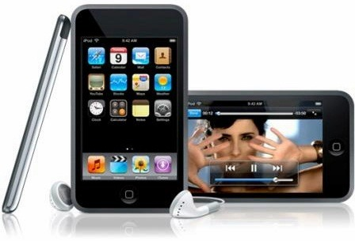
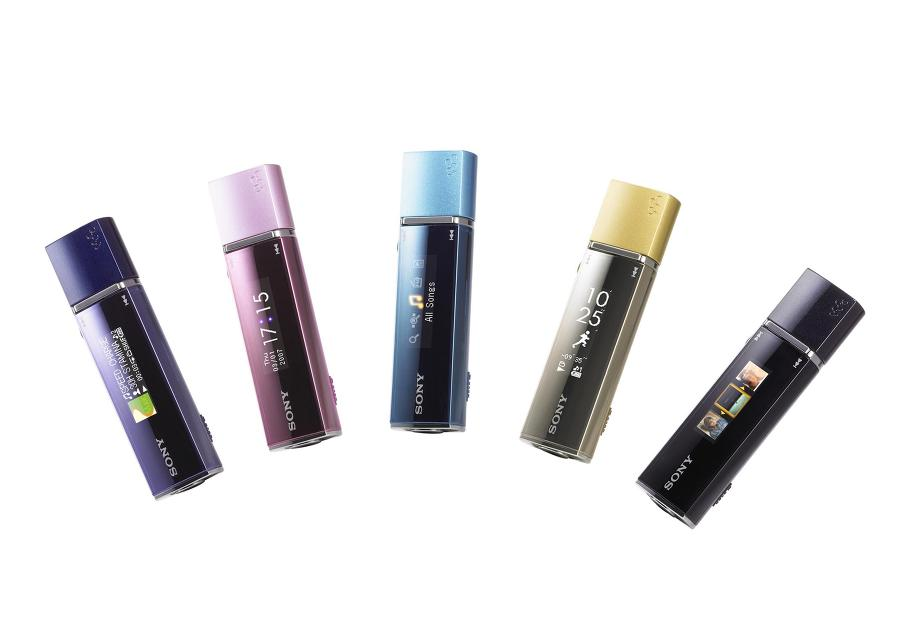
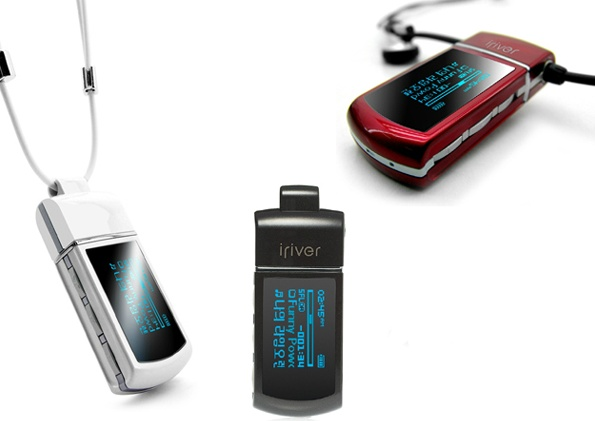
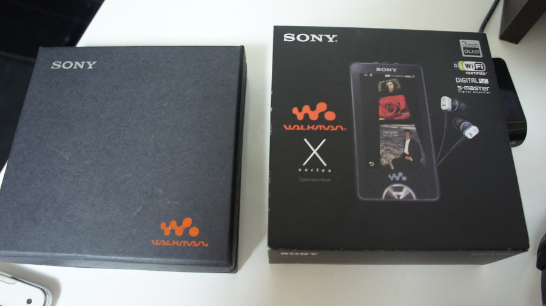
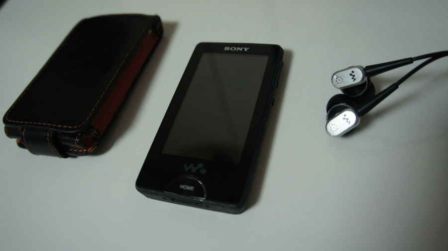
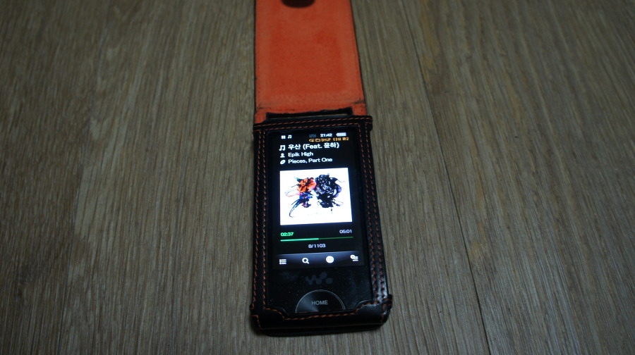

현재는 중고 시세도 저렴한편이니 음질에 민감하신 분이라면 NWZ-X1050을 추천한다.

요새야 핸드폰으로 음악 듣는 사람이 많고, 저도 어느정도 그럴때도 많은편이다.

사실 이노무 지름신 때문에, 거쳐간 MP3만해도 많이 사봤다.

코원 S9, 애플, 아이팟 터치 1세대, 2세대, 소니 NWZ-S544, NWZ-B170, NWZ-B142F, NW-E013, 아이리버  IFP-700, B20, N10 (스와로브스키), E10, 삼성 U6, 현원 모비 블루 큐브 등 많이도 썼다.

그 중에서 기억에 남는 MP3는 IOS가 내장되서 큰 충격을 가져다 주었던 아이팟 터치 1세대, 2세대.

그저 앱을 설치할 수 있고, 멀티 터치만으로도 신세경이었다랄까?

사실 mp3로서의 편의성은 잘 모르겠다. 나는 아이튠즈를 소닉 스테이지 만큼이나 (사실 소니기 스테이지 보단 덜) 불편하다고 느끼기 때문.

음악 폴더 구성은 이동식 디스크로 쓰는게 좋다고!!

뭐 물론 각종 앱이 설치 가능해, 사실상의 게임기로써 쓰기도 했으니… MP3라 보기엔 애매한 감이 없지 않다.

또 꼽자면 소닉 스테이지의 지옥만 빼면 음악 재생에 있어 최적화되었던 립스틱 MP3. NW-E013이었다.

 

나는 파란색 모델 갖고 있었는데, Intelligent Shuffle 기능이 정말 꽤나 만족스러워서, 운동중이나 산책중에 너무 너무 요긴했다.

모드도 굉장히 다양해서 어떤 알고리즘으로 이렇게 인텔리젼트한 셔플이 되는걸까 하고 한참 고민했던 모델.

보급형 기기에도 있는 인텔리젼트 셔플이나, 이후 모델들에 포함된 Zappin기능이 NWZ-1050엔 없는 것이 좀 아이러니 하다. 넣어달라고!

마지막으로 하나 꼽자면, 아이리버 N10을 꼽을 수 있다. 무엇보다 목걸이형 디자인으로 무엇보다 편해서 좋았다. 사실 IFP-700에서 받은 느낌의 연장선에서 구입했던건데 아이리버 기기 쓰면서 음질이 좋다거나 인터페이스가 탁월하게 편리했다거나 이런 기억은 없었던게 사실이다.

아!! 코원 S9는 코원 음질이 좋다 좋다해서 사봤었는데… 기대 이하였음.

음질이 나쁘다는 얘기가 아니라, 극찬을 들었던 것만큼 차이가 나지 않았다는 의미다.

그리고 가장 최근 핸드폰으로 음악 듣다, Ultrasone Pro-900을 구입한 김에 구입하게 된 NWZ-1050.

디지털 앰프가 내장되어 있어 음질의 차원이 다르다는 말을 듣고 구입하게 됐다.

 

난 막귀인줄 알았는데 이 정도로 차이날줄이야? 내가 차이를 느꼈다니!

특히 내가 사용중이던 휴대폰이 VEGA LTE라서 음질이 그저 그랬던 영향도 컸던듯 싶다.

실제로 휴대폰과 PRO-900 조합은 그저 그랬으나… NWZ-1050과 PRO-900의 조합은 엄청난 시너지였다. 탁월한 공간감이란…ㅎㄷㄷ

실제로 PC 내장 사운드 카드랑 연결했던 PRO-900도 기대 이하였던걸 보면 NWZ-1050이 얼마나 괴물인지 알 수 있을 것.

발매 당시 50만원에 가까운 금액이었던걸로 기억하는데 그만큼 하이앤드 기종이지 않았나 싶다.

물론 스펙이나 이런 비교상으론 매우 큰 차이가 있으나 현재 발매된 아이리버 [AK100](http://prod.danawa.com/info/?pcode=1814212&cate1=22592&cate2=22914&cate3=22961&cate4=0) 스러운 느낌이 났던 하이엔드 기종이라 볼 수 있었다.

번들이어폰은 nc-020과의 조합도 굉장히 괜찮은 편인데, 공간감은 당연히 pro-900보다 한참 못하지만 이어폰이라는 점을 감안하고, 번들이라는 점을 감안했을 때 그 만족도는 절대 낮은편이 아니다.

nc-020의 nc가 noise canceling의 약자인 만큼, 노이스 캔슬링 기능도 동작하는데… 이건 뭐 사실 헤드폰으로 듣는 음 차단과 크게 다르지 않은 수준이니 넘어가자. (기본적인 커널형 이어폰의 음 차단보다 조금 더 좋은 정도랄까?)

이 제품은 중고나라 장터에서 구했는데, 시세와 같은 금액에 정품 가죽 케이스 + nc-020 새제품도 함께 주셨다.

발매된지 꽤 된 제품임에도 원래 배터리가 오래가는 제품이다보니 배터리에 대한 걱정도 덜한편이고.. 새거 사기엔 여전히 너무 비싸다. 이건 덤핑도 안하나?

글쓰다 보니 내가 소니 제품을 자주 사용하게 된 데에는 소니 mp3가 배터리가 오래가기 때문이기도 했다는게 다시금 기억났다.

그리고 몇몇 제품을 제외하고는 겨울철 주머니에 넣은 상태로 작동 가능하다는 점도 메리트였고.

이 제품을 구입한 시기가 Pro-900과 같은 시기니 대략 5달 정도 된거 같다.

사실 휴대폰도 들고다니면서 mp3도 들고다니는 것은 여간 번거로운게 아닌데, 그런 번거로움을 감수할 만큼의 음질 차이를 보여준다.

이 제품을 사고나서 Head-Fi라던가 5.1채널 구성에 대한 고찰을 시작했으니… 얼마나 큰 차이를 내가 느꼈으면 그랬겠는가?

현재는 중고 시세도 저렴한편이니 음질에 민감하신 분이라면 NWZ-X1050을 추천한다.

