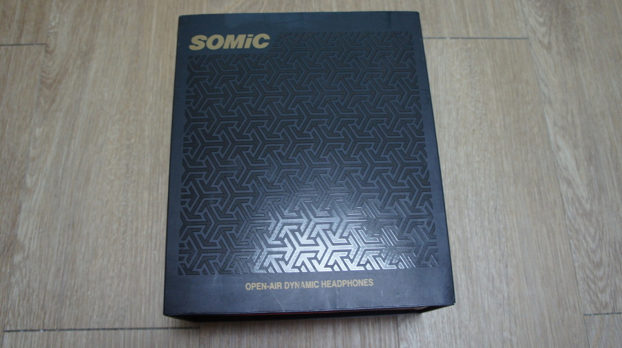
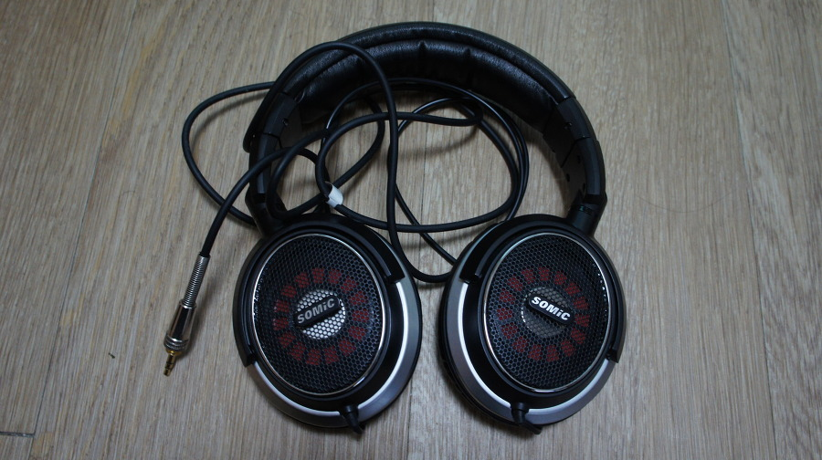

대륙의 명기 Somic사의 제품 MH463이다.

구입했던 2011년 당시 8만원 주고 구입했던 제품으로, 일반적인 헤드폰 20만원급에 육박한다는 풍문을 믿고 구입했는데 그정돈 아닌거 같다.

[구멍막기 튜닝](http://blog.naver.com/hongsy2340/10114197472)을 안해서 그런가?

저역에 강하다고 해서 구입했는데, 확실히 저역은 괜찮은 편이다. 가요 많이 들으시는 분들에겐 적합하지 않나 싶다. 문제는 그거보다 답답한 공간감에 있다. 

실제로 다른 헤드폰을 잘 안들어봤을땐 몰랐는데, AKG-550이나 UltraSone Pro-900 듣고나니 심하게 답답한 거였구나를 여실히 느꼈다랄까?

가격이 저렴해도 명색이 헤드폰인데 공간감이 좀 아쉬웠다. 

그래도 한 2년 쓴거 보면 나쁘지 않다는 반증이 아닌가 싶다.

사실 이 가격대에서 딱히 더 좋은 대안은 별로 없는거 같다.

비교했던 모델은 AKG-550이나 Ultrasone Pro-900만해도 가격이 5배 이상 된다고 봐야되니까.

이 가격대에선 충분히 훌륭한 제품이다.

이 헤드폰 이전에 사용한 [ATC-SJ1](http://shopping.naver.com/detail/detail.nhn?query=%EC%98%A4%EB%94%94%EC%98%A4%ED%85%8C%ED%81%AC%EB%8B%88%EC%B9%B4%20ATH-SJ&cat_id=40009307&nv_mid=4110036724&frm=NVSCPRO) 보다 비싸긴하지만, 확실히 훨씬 좋았으니까 말이다.