어린 시절부터 각종 마약 게임을 두루 섭렵한 나지만, 심시티는 그렇게 심취하지 않았었다.

오히려 롤러코스터 타이쿤을 조금 더 재밌게 했고, 기타 마약 게임 계보인 FM, 히어로즈 오브 마이트 앤 매직, 문명 등은 뭐... 정줄 놓고 해왔지.

그렇다보니 심시티 리부트 예약 판매에도 아랑곳하지 않고 버텨왔으나...

주변에서 너무들 많이 하는걸 지켜보고 듣다보니, 짬내서 심시티4를 다시 해봤더니, 아... 기왕할꺼면 심시티 리부트로 하고 싶어지더라.

아무래도 지인들과 같은 광역에서 플레이가능하다는 점이 매우 솔깃했고 말이지.

그렇게 시작한 심시티 리부트

장점부터 나열해보자면,

- 수도, 전기가 도로 개념으로 통합되면서, 관리가 좀 더 수월해졌다.

- 시각적으로 아주 많이 발전해서, 눈이 즐겁다.

- 어쨋거나 온라인이니, 상호작용이 매우 적긴해도 전작들보다 상호작용하는 재미가 커졌다.

- 완성도 높아진 튜토리얼

- 전작보다 나아진 없는거보다 나은 적절한 퀘스트

- 도전과제 도입

- 원형으로 도시 설계 가능. 미적 감각을 살릴 수 있음.

단점도 쫌 많은데....

- 무한 롤백 도시가 되는 버그로 인한 짜증...

- 나는 겪지 않았지만, 저질같은 접속 불가 사태

- 광역간 선물 지연현상

- 너무나도 작아진 땅. 너무 작아져서 뭐만 할라치면 땅 크기 때문에 짜증난다.

- 전작에 원하는 도시를 만드는 게 좀 더 어려워졌는데, 이게 버그때문인지 내가 못하는건지 헷갈림. (심각한 교통체증, 학교를 안가는 현상 등...)

뭐 이러쿵 저러쿵해도 재밌게 하고는 있다.

디아블로3는 서버 장애도 장애지만, 게임 자체의 완성도도 짜증이었다면,

심시티는 버그 수정 및 땅만 좀 커져도 딱히 단점 지적안해도 될만큼 괜찮게 나왔다고 본다.

워낙에 이런 시뮬레이션 류 게임을 좋아하는 지라, 과감하게 디지털 디럭스 에디션으로 질렀는데, 그게 후회스럽지 않을 만큼 즐겁게 즐기고 있다.

이걸 지름으로써, 군단의 심장 한정판을 못질렀는데... 추가 입고되면서, 아직도 군단의 심장 한정판 있더라.

군심을 사게 되도, 싱글만 플레이하게 될거 같아 아직도 고민중...

얘기가 좀 샜는데, 여하튼 난 개인적으로 심시티 2000이나, 심시티 3000보다 즐겁게 하고 있다. 제발 버그랑, 땅좀 크게 쓸 수 있게 빨리 조치해줬으면 하는 바램이다.

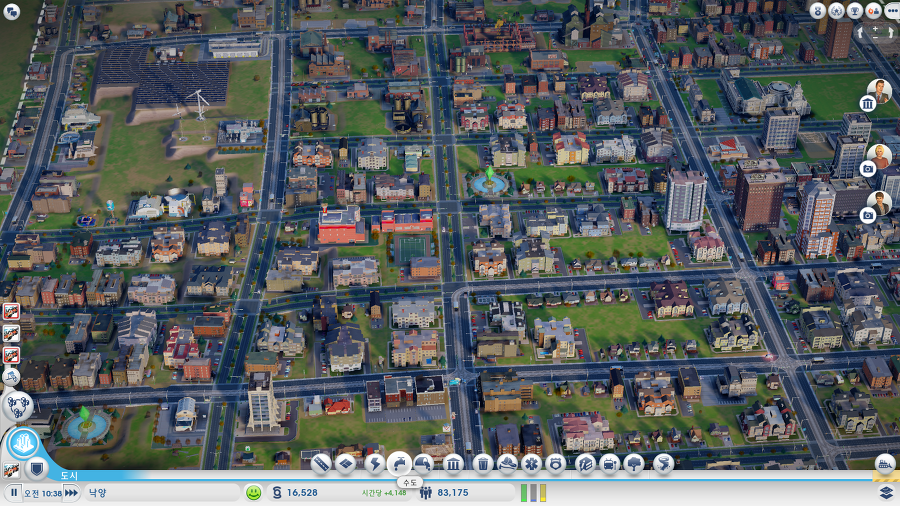

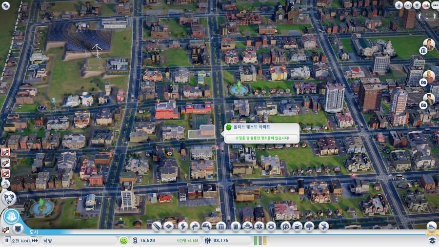

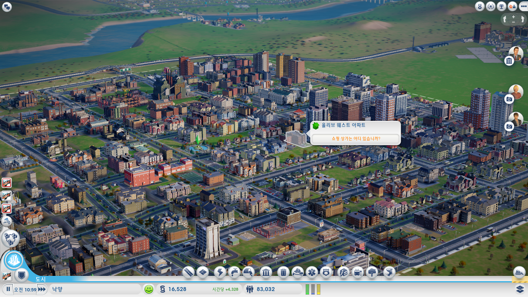

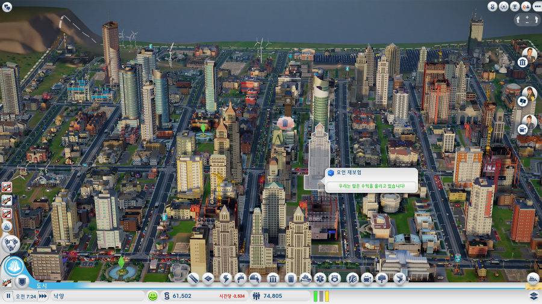

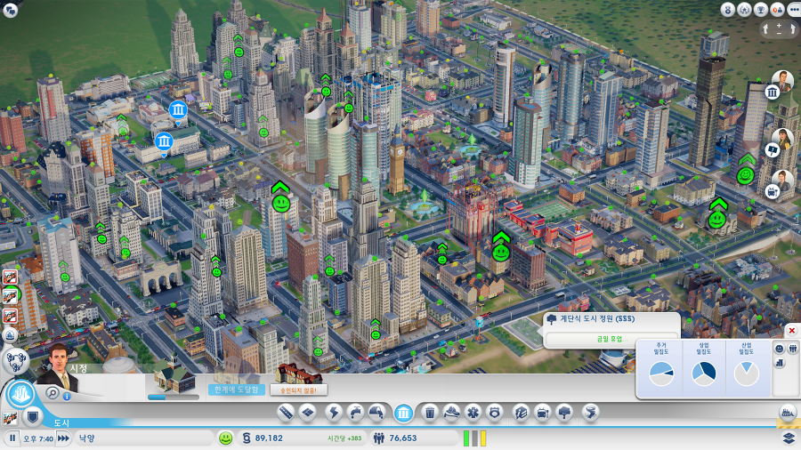

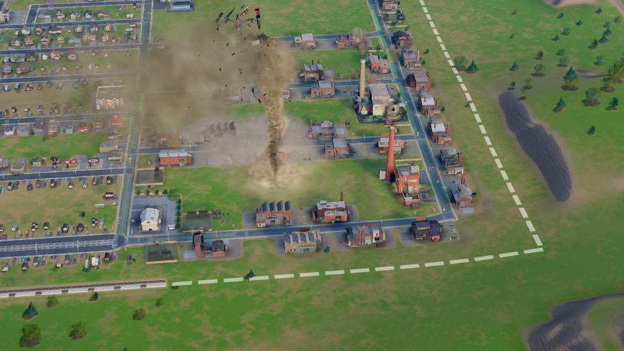

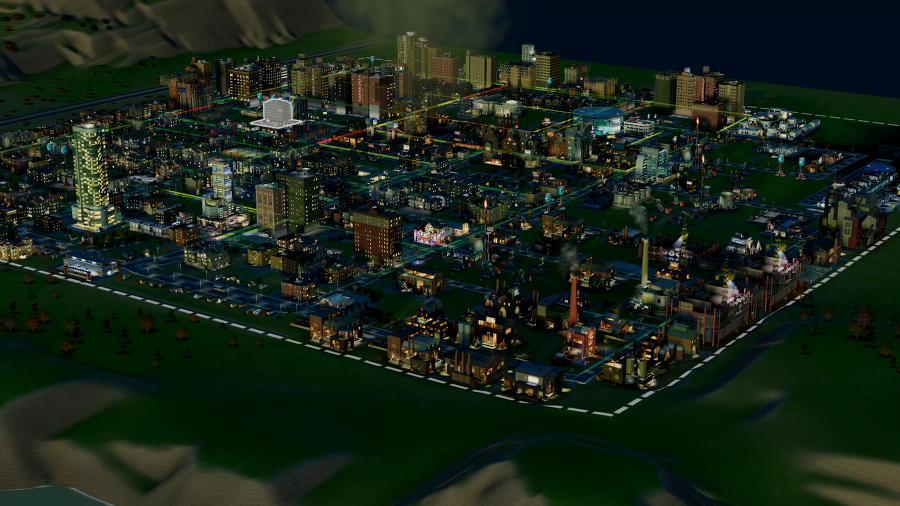

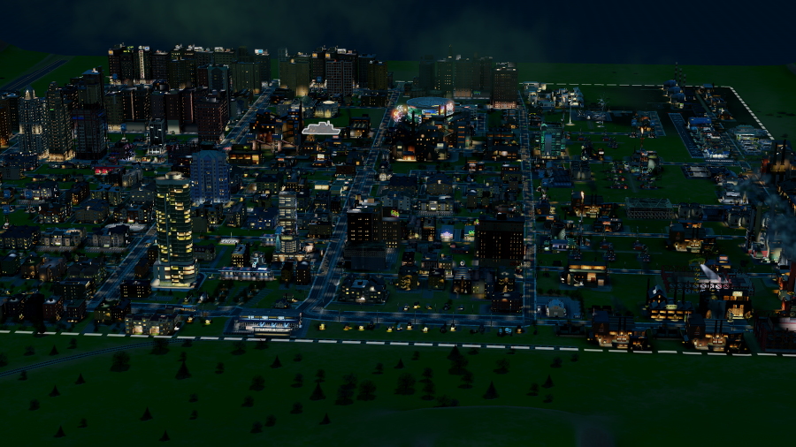

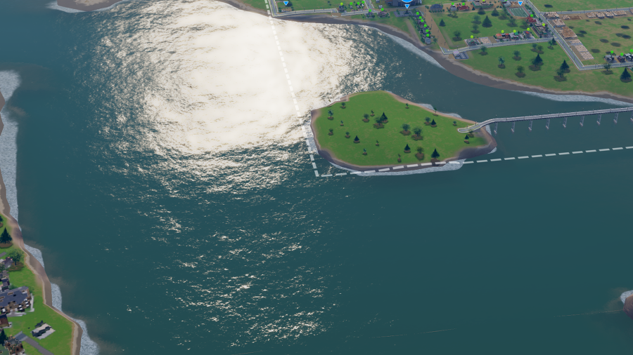

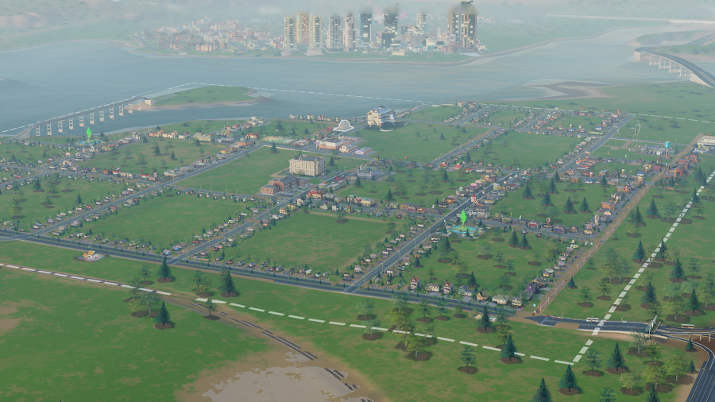

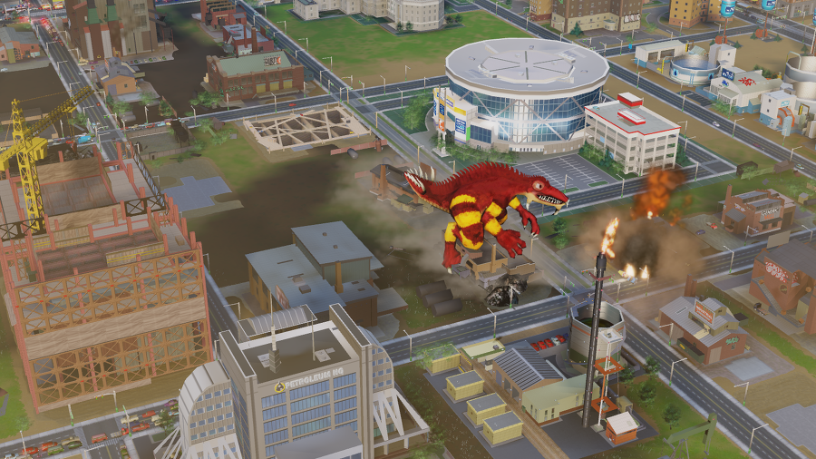
