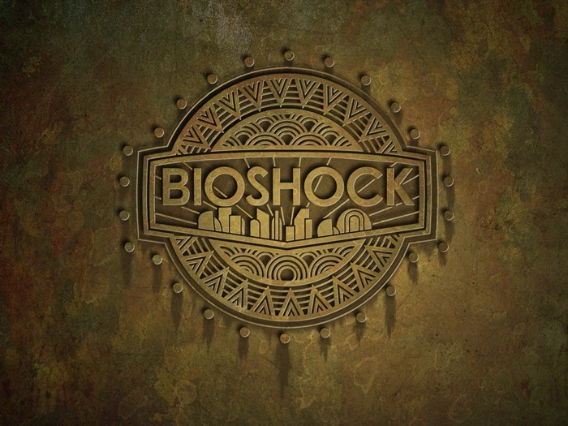

헐… 내가 이런 게임을 놓쳤다고?

분명 이 게임이 발매된 시기는 내가 회사 일로 정신없이 바쁘던 시기이긴했다.

하지만… 좀 널널해졌던 시기에라도 했어야했는데…

너무 명작이다 이건…!!

세기말적인 분위기에, 적절한 난이도 (사실 쫌 어렵다), 적절한 퍼즐…

너무나도 멋진 시나리오…

게다가 리틀 시스터를 구원하느냐, 채취(?) 하느냐의 기로에 세우고, 각기 다른 결말을 주는 전개 방식은 너무도 맘에 든다.

빅대디가 주인공인줄 알았는데, 리틀시스터의 경호원이었다는 것부터 시작해서, 전체적인 분위기나 설정이 다 멋지다.

짜임새 있는 설정과 시나리오만이 이런 명작을 만들 수 있는 것일까?

아…! 이래서 메타스코어가 90점이구나하고 감동했다.

당신이 아직 안해봤다면 꼭 해봐야 할 명작!