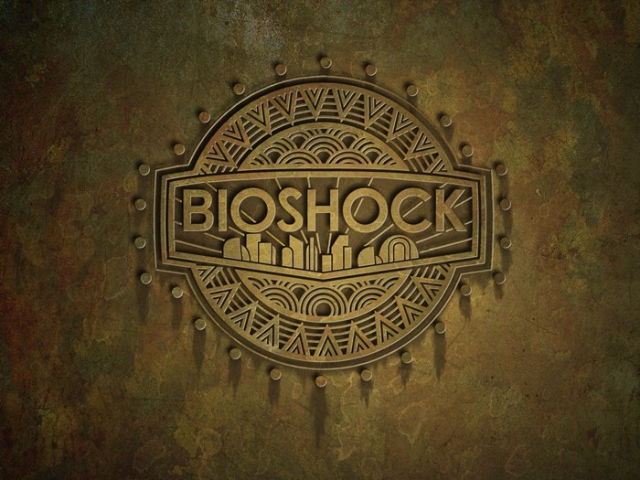

... 내가 이런 게임을 놓쳤다고?

분명 이 게임이 발매된 시기는 내가 회사 일로 정신없이 바쁘던 시기이긴했다.

하지만… 기억해뒀다가 널널해졌던 시기에라도 했어야 한다는 아쉬움이 남을 만큼 명작이었다.

조금씩 나아지곤 있지만, 공포스러운 분위기를 괴로워 하는 나로썬, 사실 공포 게임인줄 알고 두려워했던 것도 있다.

그래서 트레일러도 잘 안 찾아봤고, 당시의 극찬도 바이오 하자드 같은 계열의 게임으로써 인정 받은줄 잘못 알고 있었다.

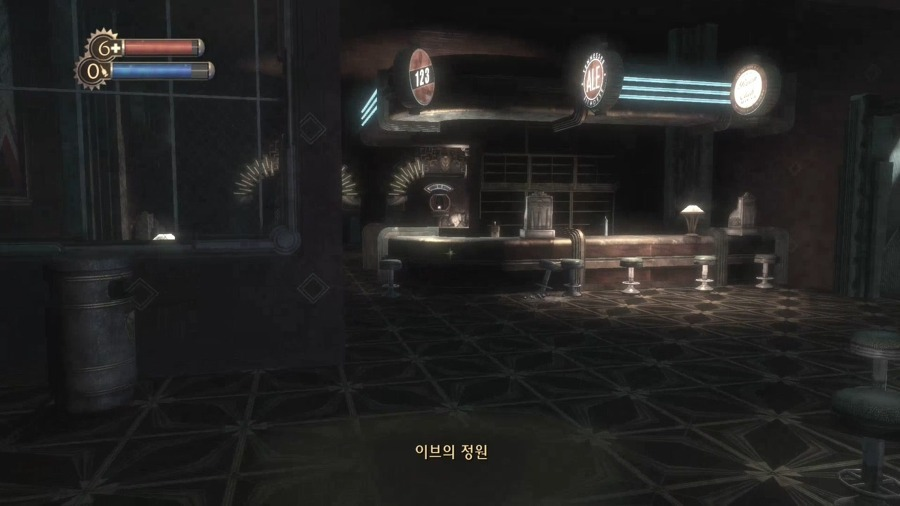
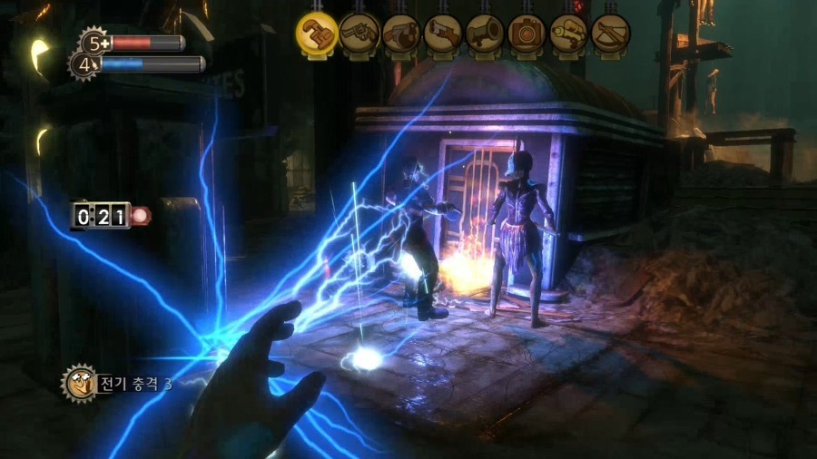
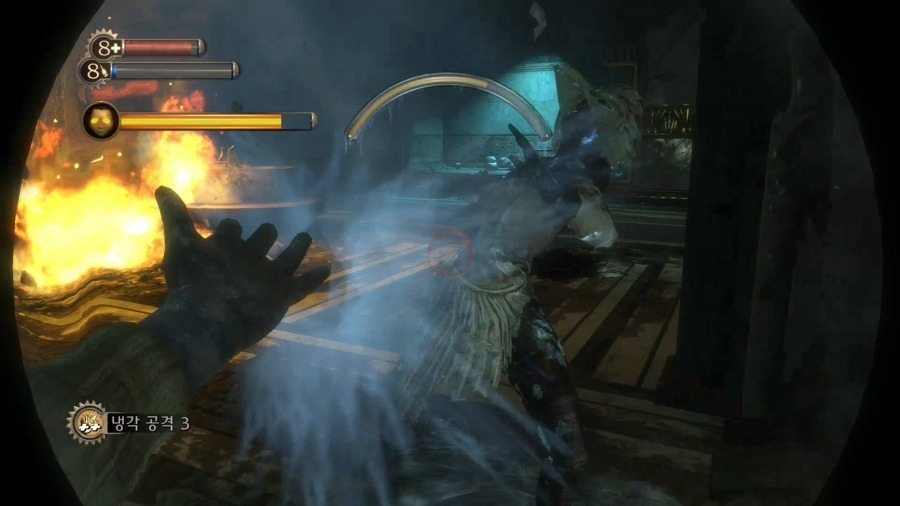

이 게임의 배경은 1960년대다. 하지만 실제 1960년대라기보다는 해당 시대를 참고해 아틀란티스와 같은 수중 도시를 연출해냈고, 전반적으로 세기말스러운 분위기를 내는 게임이다.

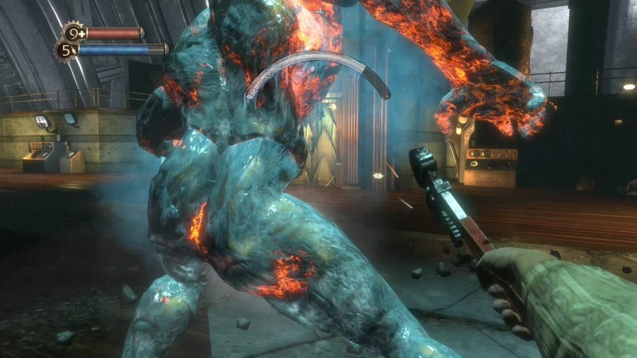
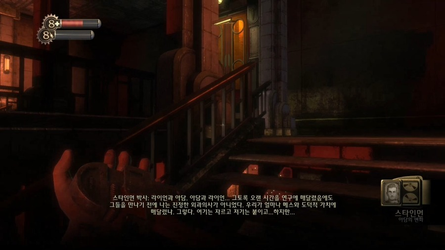

빅대디가 주인공인줄 알았는데, 리틀시스터의 경호원이었다는 것부터 시작해서, 전체적인 분위기나 설정이 다 마음에 들었다.

또한 일반적인 게임에서 마법이라는 카테고리로 주어지던 특수 기술이 플라스미드를 이용한 초능력으로 표현되는데, 이 역시 중세 판타지스러운 요소를 또 디젤 펑크에 근접한 세계관에 녹여내는 데에 성공했다고 볼 수 있다.

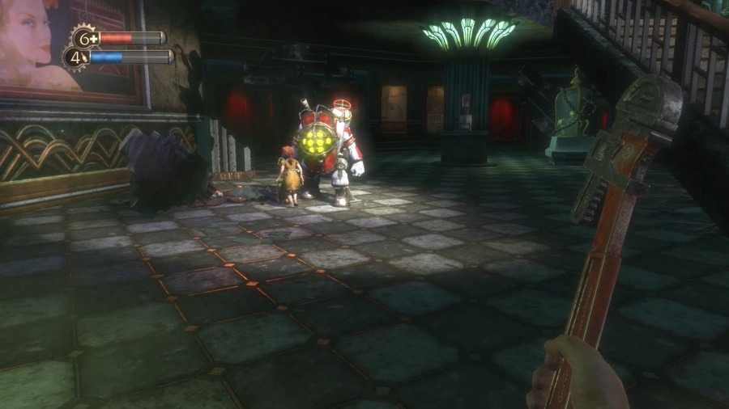
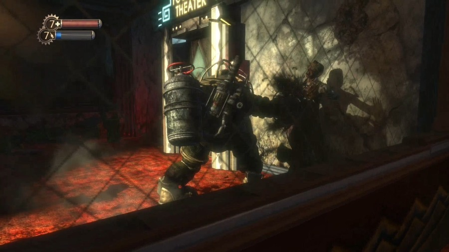

게다가 리틀 시스터를 구원하느냐, 채취(?) 하느냐의 기로에 세우고, 각기 다른 결말을 주는 전개 방식은 너무도 맘에 든다.

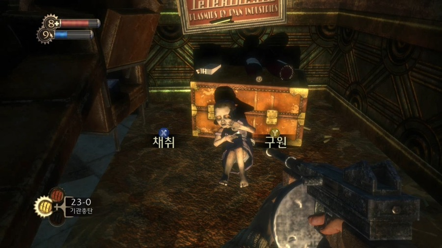
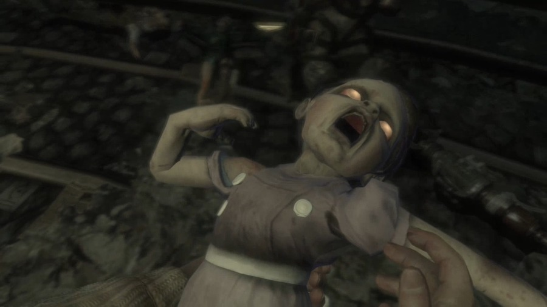

또한 스토리를 전달하는 방식이 녹음기 등을 통한 힌트와 짜임새 있는 동선과 전개가 함께 했다.

사실 이런 게임이야 말로 스토리의 중요도가 매우 큰데, 그 완성도는 훌륭했다.

멀티 엔딩이라서 유저의 선택에 따라 결과가 달라지는 것도 적절한 수준이었다고 생각이 든다.

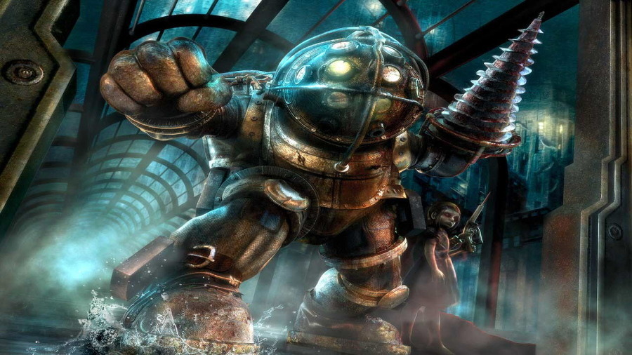
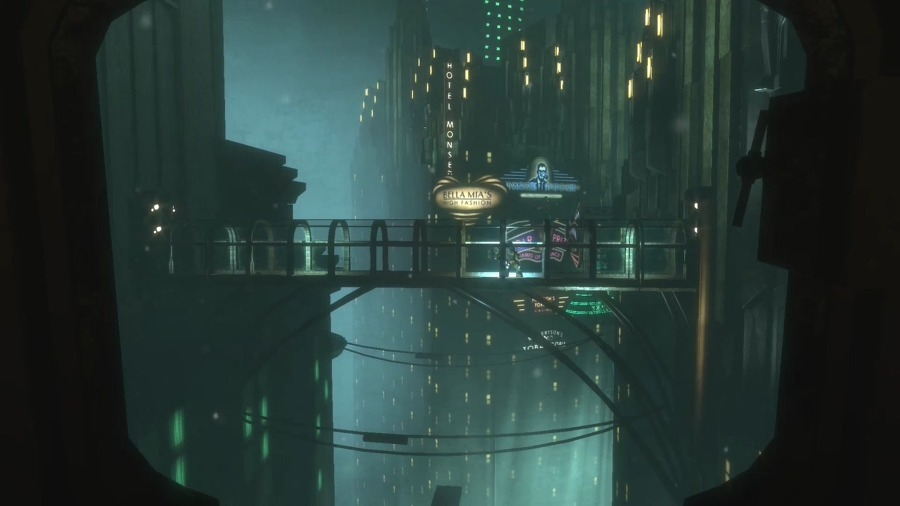

아…! 이래서 메타스코어가 90점이구나하고 감동했다.

당신이 아직 안해봤다면 꼭 해봐야 할 명작!

