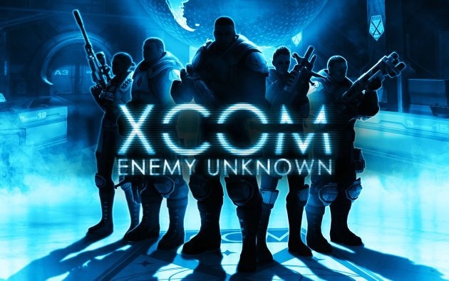

X-Wing이랑 헷갈렸던 게임.

내가 매우 선호하는 조조전, 파랜드 택틱스, 슈로대 류의 턴제 전략 게임이다. 

파이어 엠블렘이나, SD 건담 G-Generation 처럼 유닛이 한번 죽으면 영원히 죽는 게임이다.

당연히 세이브 로드 신공으로 깨야되는 극악 난이도류 게임.

특히나 여타 게임들과 다르게, 이동 후 샷이 기본인데다가 (저격병 등 및 스킬로 인한 반응 제외), 경계를 통해 돌진시 개죽음 빈도도 높은지라 신중한 컨트롤이 기본이 되어야 하는 게임.

이 이야기는 즉슨 무쌍이 어렵다. 4차 슈로대에서 서바인 돌격같은건 꿈도 못꾼다.

화끈하기는 커녕, 섬세하고 계산적이어야 함에도 이 게임은 재밌다. 턴제 전략 게임을 좋아한다면 필구!
