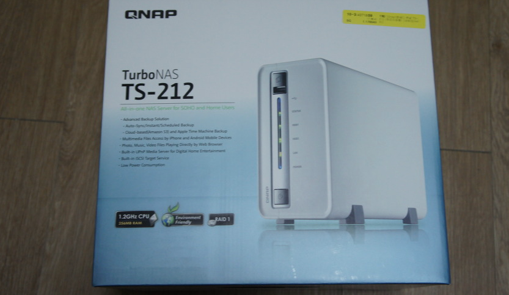
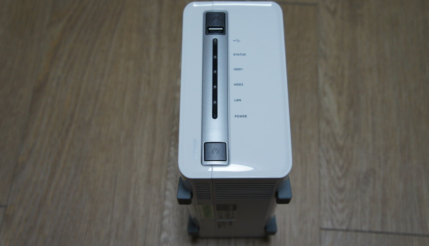

NAS 스토리지 세팅은 Seagate 2TB  + Seagate 3TB 해서, 5TB를 RAID 0로 묶고 사용중.

원래 쓰고 있던 방식
1. 대용량 데이터는 집에 PC를 켜고 원격 서버처럼 써왔음.
2. 그러다 IPTIME WOL로 켜고 끄고 시작함.
3. 기타 소용량 데이터 (사진, 에뮬레이터 게임, 음악 등) UCloud (50gb) + DaumCloud(50gb) + NDrive(30gb) + Google Drive (5gb)를 통한 데이터 동기화를 이용해옴.

기존 방식의 불편했던 점
1. 전기세도 넘 많이 나오고, 특히 새벽에 소음이 작렬…. 애초에 저소음 PC가 아니다보니 잘때 소음이 너무 거슬림. 음…사실 낮에도 좀 거슬림.
2. 집에 PC가 여러대임. 또한 휴대폰 등의 모바일 기기에서도 억세스를 쉽게 하고 싶었음.
3. 내가 원하는 동기화 데이터 양이 많다보니, 4가지 서비스를 다 합쳐도 135gb뿐이라 아쉬웠음. 특히 여러개로 쪼개져서 서비스를 이용하다보면, 내 데이터를 어디다 놨더라하는 고민이 들고, 카테고리별로 다른 데이터를 백업했었으나 그렇게 써도 내 데이터가 해당 서비스별 허용 용량 초과시 고민에 빠지게 되더라.

이런 점을 해결하기 위해 NAS를 구입했음.

베어본을 쓸까 고민했었으나… 베어본도 24시간 켜두는데에는 적절치 않다고 판단. 결국은 PC라는 한계는 존재한다고 생각했다.

세팅 후 사용한지 대략 10일쯤 되고 나서 든 생각은

1. NAS업체중엔 메이저한 업체 제품임에도 어플리케이션 완성도가 너무 떨어진다. Music Station, Photo Station은 괜찮은데… Multimedia Station이 내가 원하는 완성도에 한참 모자름. 특히나 Google Music 동기화 및 어플을 써오던 상황이라 그에 비해 아주 많이 아쉬움. 특히 모바일 앱의 퀄리티가 망
   * FTP를 열고, ES 파일 탐색기로 NAS에 접근 한 뒤 파일별로 적절한 어플로 연동시킴으로써 해결. 기본 앱은 도저히 쓸 수 있는 퀄이 아님… 특히 동영상이 열리지 않는 알 수 없는 버그가 기본 앱들(QDisk, QMobile)에서만 발생.
   * DLNA를 이용하니 좀 낫더라. DLNA 앱을 Media House를 쓰는데, Google Music만큼의 완성도는 아닌게 아쉬움. 게다가 집밖에선 사용 불가능하단게 큰 흠. 결국 ES 파일 탐색기 이용중.
2. 이전 원격 서버때부터 귀찮았던건데, SK 브로드밴드가 포트를 막아놓은게 많아서 포트 변경해서 서비스 해야 되는게 많음.
   * KT는 안그런가? HCN은 어떻지? 1년 약정 끝나자마자 해지해버릴테다!!
3. 디스크 전체가 열리질 않다보니 Download Station에서 다운 받은 파일을, 원하는 경로로 옮기려면 Web File Manager를 쓰지 않고서는 너무 느림.
   * 디스크 자체를 공유 할 수 있는 방법을 못찾았음. 이걸 알면, 디스크 내 이동이 빠르게 될거 같은데…
4. 세워서 쓰지 않으면 하드 디스크 진동으로 인해 소음이 발생. 이를 해결하기 위해 나는 케이블 모뎀을 밑에 깔아서 진동을 흡수 시킴.
5. 관리 메뉴에서 지원하는 서비스 자체는 아주 많음. QPKG로 설치가능한 서비스들도 좀 있고…
SSH도 열려있어 확장의 여지는 많아 보임. 다만 내가 리눅스를 잘 운용할줄 모르는게 안습… 배우자 배워~~
6. DLNA가 괜찮긴한데, Video 정보 파싱 기준을 모르겠더라. 음악은 mp3 tag인거 알고, 원래 태그 관리를 해왔다보니 파일들이 잘 정리되어있는데 Video는 뭘 편집해야 되는건지 몰라서 뭔 파일인지 알기가 어려움.
ownload Station 완전 편리함. PC를 켜지 않고 원격 다운로드가 된단건 아주 편하다.
1. 기가비트 랜을 사고 싶어졌음.

공유기도 새로 사야하고 기가비트 랜을 추가로 달아야 하는 것이 번거롭긴하지만…

다운 받을때는 제껴놓고라도 NAS와 데스크탑 간의 전송 속도가 답답해…

원래 2TB하드는 있었다보니 구축 비용도 아주 크진 않았고, 전력 소모량이 적으면서도 성능이 준수한 편이라 아주 맘에 든다.

물론 몇가지 불편한점이 있긴하지만, 인터넷만 바꾸면 해결할 수 있는 문제가 다수였으니 괜찮더라. (물론 현재는 포트 변경으로 해결한 상황)

IPTIME의 NAS-II와 NASN-322도 고려 대상이었는데, 가장 모델이 많고 서비스 역사가 길다는 점, 전력 소모량이 가장 적다는 장점으로 선택한 QNAP TS-212에 대한 선택은 탁월했던듯 싶다. 추천!