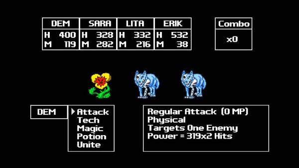

Zeboyd Games에서 만든 타일 기반 2D RPG 게임.

드래곤 퀘스트 패미컴 버전을 연상케하는 그래픽이지만, 싼 값에 한번 사봤는데 의외로 재밌었어요.

레벨업시 스킬을 선택해서 성장 시킬 수 있는 점과, 레벨 디자인이 적절하다는 점 등이 좋았습니다.

1인칭 전투 시점이지만 이는 전투 시점만이고, 필드 이동은 탑뷰.

레벨 업을 하다보면 스킬을 고를 수 있는데, 그로 인해 육성의 재미를 조금 더 부여하는 데에 성공했습니다.

레벨 디자인도 나쁘지 않은편이고, 애초에 장단점이 슈퍼 패미컴 시절의 일본식 RPG를 따라가기에 그리 불쾌한 요소는 없었습니다. (길찾기가 귀찮기는 함.)

시점에서부터 진짜 드래곤 퀘스트가 생각이 좀 많이 나지만, 완성도는 괜찮은 (이 개발사 게임들이 다 전반적으로 괜찮더군요. 일본 고전 RPG 스러운 느낌이 강하고요.) 게임입니다. 추천~!

