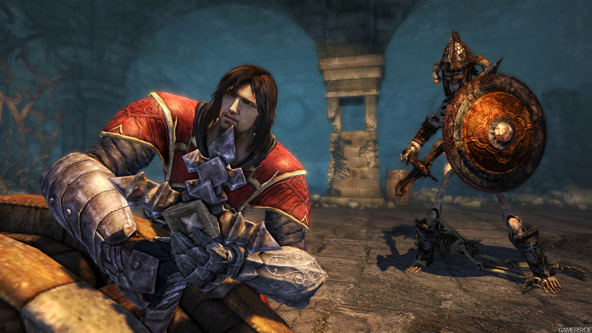
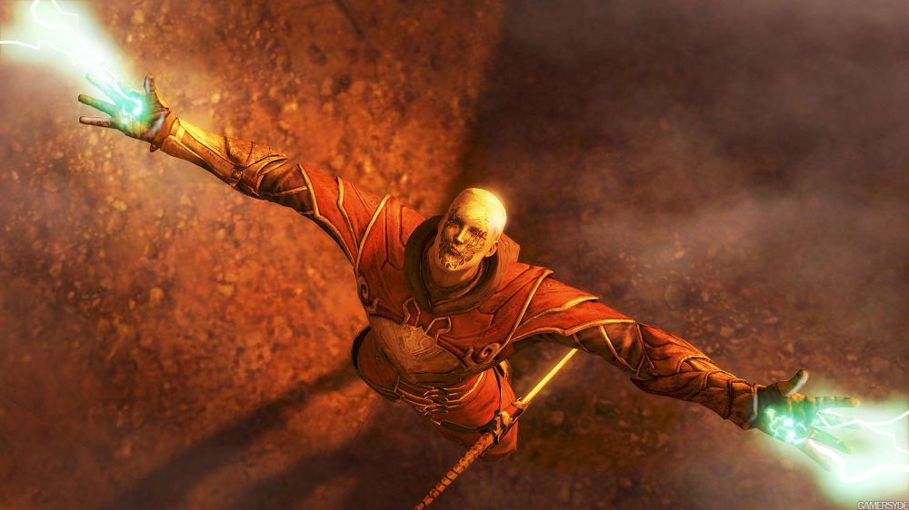
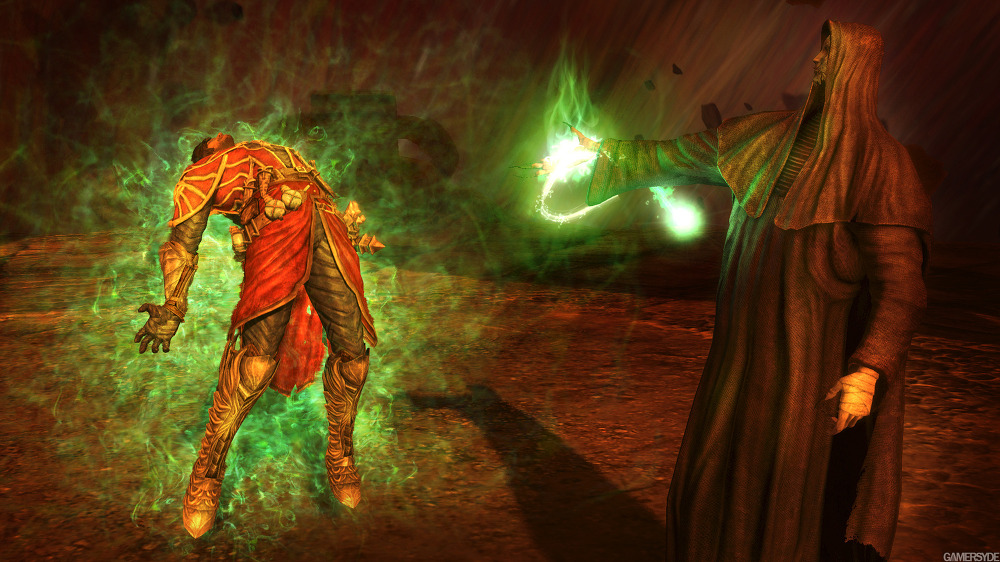
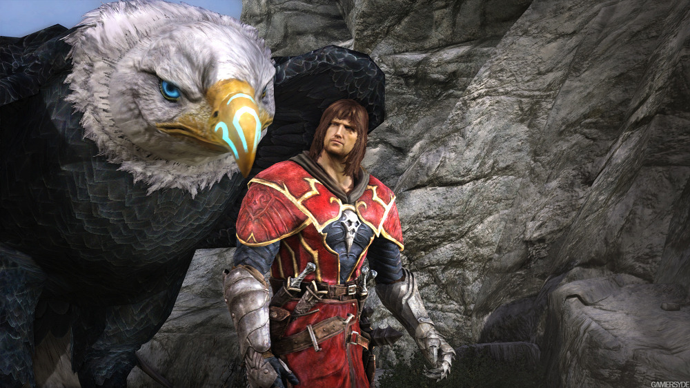
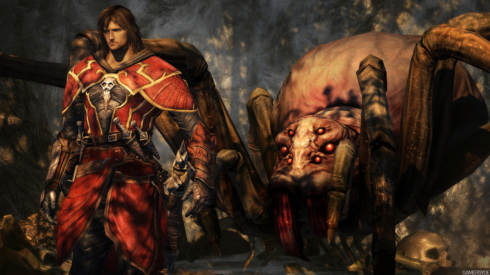

2D 악마성에 익숙한 많은 게이머들이, 3D 악마성을 인정하지 않는다지만…

완다와 거상이나 갓 오브 워를 연상 시키는 액션성과 퍼즐은 나쁘지 않은 게임임을 말해준다.

물론, 고정 시점이라는 것이 참 짜증도 많이 유발하긴한다. (실제로 카메라 위치도 그닥 좋지도 않음)

그럼에도 이 게임이 할만했던 것은 귀무자의 영혼 흡수 스러운 요소도 있고, 각종 기술을 언락해 화끈한 액션을 펼칠 수 있기 때문이랄까?

보스전도 재밌는 편이고. (다만 겁나게 어렵다. 타이밍을 알려줬다 말았다 그거땜시 더 헷갈려서 열불터짐.)

나의 악마성은 이런게 아냐! 정도가 아니라면, 분명히 할만한 3D 액션 게임임에는 분명한 작품.

