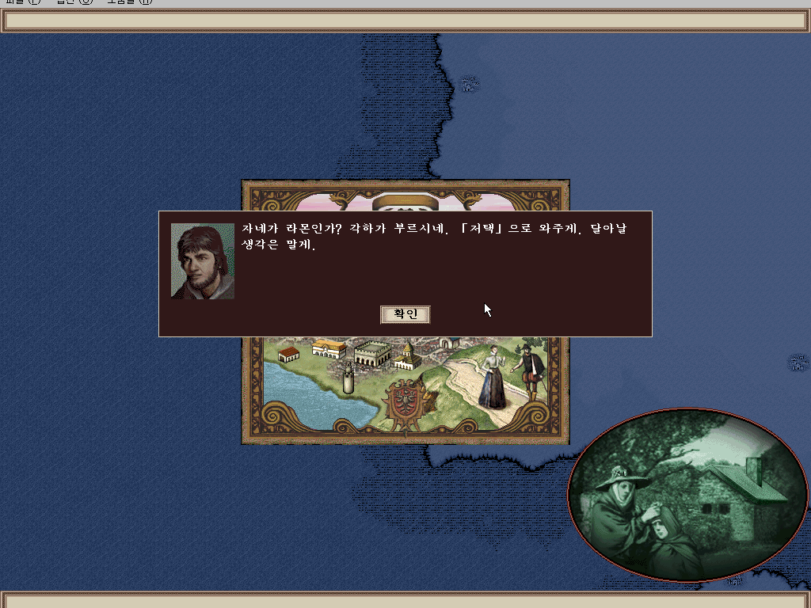
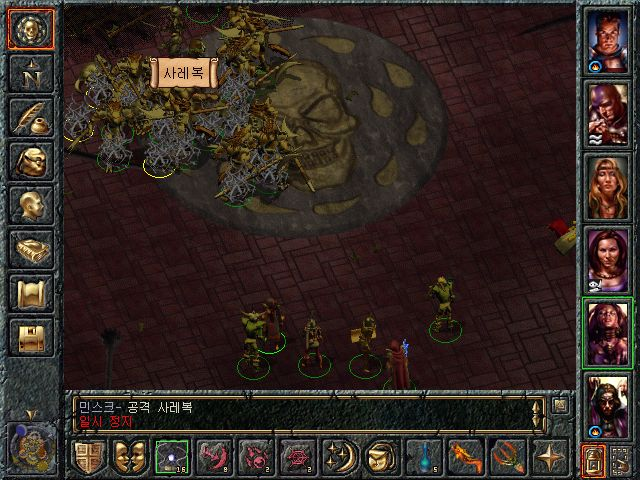
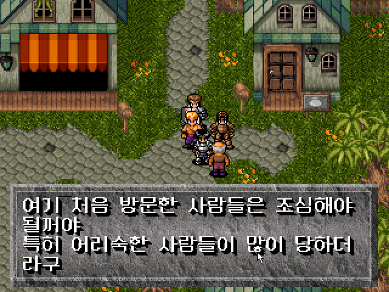

DOS 게임 시절부터 사람들은 다양한 자유도 높은 게임을 떠올려왔고 이에 대해서 간단한 소개를 해보고자 한다.

# 울티마 7

- 울티마 시리즈는 전통적으로 자유도와 창의성 사이에서의 균형을 잘 잡은 작품이었다.
    - 그 중 7은 정점에 있었던 작품이다.
        - 게임에 나오는 대부분의 사물로 플레이어가 상상하는 거의 모든 행동을 다 해 볼 수 있다. 양털에서 실을 뽑아 옷감을 만들어 옷을 짓기도 하고, 밀가루를 반죽하여 오븐에 구워 빵을 만들어 먹을 수 있다. 이러한 요소들은 훗날 쥐약을 넣은 빵으로 로드 브리티시를 살해하는 울티마 9편의 플롯으로 계승된다.
        - 중요 인물들도 볼 일이 끝나면 죽여도 아무 문제가 없고, 특정 시점을 넘어서면 아마게돈을 써서 대륙의 모든 사람들을 다 죽여도 스토리는 잘 진행된다.
            - 또한 특별히 봐야 하는 이벤트도 없기에, 아바타는 7편에서 로드 브리티쉬를 한 번도 알현하지 않고 엔딩까지 진행할 수 있고, 심지어 7편의 대표적인 악당 배틀린과는 이야기 한 번 안 섞고 몰래 검은 문을 파괴할 수도 있다.
- [울티마1) RPG의 시작 울티마1 공략 #CRPG - YouTube](../../img/2023/https://www.youtube.com/watch?v=yGCITMDeGf4)
    - 81년 작임에도, 자유도 높은 RPG를 훌륭하게 구현했음을 알 수 있다.

# 루나틱 돈

- 이 게임 시리즈의 최대 특징은 무한한 자유도로, **게임의 스토리가 없다**
- 그냥 판타지 세상에서 살면서 돌아다니는 게 유일한 목적이자 플레이 방법이다.
- 물론 엔딩이 존재하긴 하지만 보지 않아도 큰 문제는 없다. 삶과 모험 자체가 목적인 게임으로 일본 RPG 게임들 중에서는 보기 드물게 자유도를 추구하는 게임이다.
- 임의 자유도만으로 치면 울티마 시리즈와 맞먹을 정도로 대단하지만, 그에 반해서 스토리가 없다는 건 플레이어에 따라 결점으로 작용할 수도 있다.
- 단, 울티마와는 그 방향성이 다르다. 울티마 시리즈의 자유도는 플레이어의 행동이 유기적으로 연계되거나 행동의 제약이 적다는 의미이고, 루나틱돈은 게임을 즐기는 모험의 방향성이 다양한 것에 가깝다. 발더스 게이트 시리즈를 위시한 D&D 계열의 CRPG들이나 폴아웃 시리즈 등은 게임 다방면에 걸친 자유성을 크게 높였으며 현재의 엘더스크롤 시리즈 즈음에 이르러 개체 하나하나에 의미를 부여하는 식으로 발전하고 있다.

# 대항해시대3

- 대항해시대 2편이나, 4편은 RPG적인 요소를 띄고 있지만, 이에 반해 대항해시대3는 오픈월드 항해 게임에 근접하다.
- 무제한에 가까운 자유도, 사실성이 대폭 반영된 내용 등의 이유로 이 작품은 대항해시대 시리즈 중 가장 동떨어지고 특이한 작품이 되었다. 이 독특함 때문에 호불호가 가장 극명하게 갈리는 시리즈이기도 하다. 실제로 높은 자유도 때문에 처음 시작하면 정말 뭘 해야 될지도 모를 정도다. 또한 밝은 분위기의 다른 작품들과 달리 이 게임은 사실성을 중시한 만큼 실사 포트레이트를 썼고 색조가 칙칙하며 게임 시스템이나 UI 디자인부터가 불친절하고 삭막하게 생겨서 아무 생각 없이 게임을 잡으면 적응하기가 쉽지 않다.
- 전작과는 다르게 이벤트성 요소는 삭제되고 샌드박스게임 처럼 자유도 높은 방식을 지니고 있는데, 이 게임은 아예 확실한 엔딩조차 없다. 일단 온갖 발견물을 찾아내는 걸 메인으로 하고 있고, 1차적 목표로 세계일주, 최종목표격으로 무대륙이 주어지긴 하는데 이걸 전혀 안 해도 상관없다. 초심자용 캐릭터라면 약간의 이벤트가 추가되긴 하는데 이것 역시 거의 무시할 만한 수준. 교역 뺑뺑이만 돌거나, 이슬람 세력권에서 죽치고 해적잡기만 하거나, 인원을 모아서 도시를 정복하며 깽판치고 다녀도 되는 등 대항해시대 시리즈 중에서 자유도가 가장 높다.

# 발더스 게이트

- 위 언급한 게임들에 비해서 자유도는 훨씬 낮지만, D&D 규칙을 바탕으로 세계와 다양한 상호 작용의 선을 적당히 그은 작품이라고 볼 수 있다.
    - 예를 들어 NPC를 마음대로 죽일 수 있다거나 물건을 훔칠 수 있는 반면, 성향 (D&D에서 선, 악, 중립 혹은 더 세분화된 분류로 나뉘는 성향)에 따라 다른 상황이 펼쳐지는 것을 말한다.
    - 다양한 동료 캐릭터와의 상호 작용과 이벤트는 다양한 게임 플레이 양상이 나오는 결과물로 이어지긴해서, 자유도에선 부족할 지언정 게임 플레이 경험에선 만족감을 가질 수 있는 게임이었다.
        - 어찌보면, 온전한 오픈월드이자 자유도 높은 게임을 만들기 어렵다면, 선택할만한 적정선이 발더스게이트 수준 일지도?

# 폴아웃

- 웨이스트랜드 리메이크 버전이지만, 그 자체로도 이미 올드하면서도 클래식으로 여겨지는 고전 게임이다.
- 포스트 아포칼립스 기반이며, 전투 시스템이 전략적이며 재밌는 것이 특징이지만, 지금 전반적 게임을 소개하는 맥락에서는 자유도이니 만큼 그에 대해 설명하겠다.
    
    ### 해결책은 하나가 아니다.
    
    - 대부분 RPG에서의 퀘스트는 단일 해결책을 지향한다.
        - 그렇기에 대부분 노가다성, 몇마리 처치해라, 몇개의 재료를 모아와라 같은 방법을 채택하고, 정해진 결과를 달성하는 데에 치중되어 있다.
    - 폴아웃은 이와 달리, 다양한 선택지와 그에 따른 결과가 펼쳐진다.
        - 애초에 미션자체도 단순히 뭘 해와 같은 일이 아니다.
    - 예를 들어, 플레이어가 살던 볼트(vault)에 물을 정화하는 기능을 복구하려면 다른 마을에 있는 중요한 장치를 가져와야 합니다. 그러면 그 마을을 더이상 물을 정화할 수 없게 되고 모두 죽게 될 겁니다. 플레이어가 그 마을을 구해보려고 시도할 수 있지만, 그건 또 다른 문제를 불러올 수 있습니다.
    - 어떤 마을에서는 두 사람이 마을의 지배권을 두고 싸웁니다. 둘 중 누구도 좋은 인간이라고 하기 어렵습니다. 결국 어느 놈이 마을을 지배하게 두느냐는 선택의 문제입니다.
    
    ### **문제에는 항상 다양한 해법이 있다 (그게 더 재밌다)**
    
    - 앞서 든 선택의 예시들을 플레이어가 모두 무시하고 지나칠 수도 있습니다. 문제를 모두 해결하고 다닐 필요도 없고, 문제에는 언제나 다양한 해법이 있습니다. 플레이어가 보이는 건 모두 죽이고 다니고 싶다면 그렇게 할 수도 있게 할 겁니다. 문제 일으키기 싫어서 조용히 다니고 싶다면 그렇게도 할 수 있습니다. 흥정이나 거짓을 통해 말로 해결하고 싶다면 그렇게 할 수도 있습니다.
    - 어느 하나의 플레이 스타일도 완벽하지 않습니다. 플레이어는 게임을 진행하며 여러가지를 시도하게 될 겁니다. 무장 캠프에 침투해야 할 경우를 예로 들어보죠. 잠입 기술을 이용해 잠입을 시도할 수도 있고, 말빨을 이용해 통과할 수도 있고, 아니면 전투 기술을 활용해 경비를 쏴죽일 수도 있습니다.
    
    ### **플레이어의 행동이 세계에 영향을 미친다 (그리고 세계는 플레이어에게 반응한다)**
    
    - 게임은 플레이어가 어떻게 행동했는지에 따라 반응합니다. 플레이어가 술집에서 사람을 쐈을 경우 다른 손님도 그걸 인지합니다. 플레이어가 강해보이면 못 본 척 하고 자리를 뜨고, 플레이어가 만만해보인다면 시비를 걸어옵니다. 플레이어가 명성을 얻게 되면 NPC들도 그걸 인지하고 길을 비켜주거나 보자마자 총을 쏘는 등 반응을 보입니다. 우리가 하고 싶은 건 플레이어가 게임 속에서 일어나는 일에 ‘관여’하는 것입니다.

# 마이트 앤 매직

- 우리에게 왈도체로 친숙한 바로 그게임
    
    
    
    
    
- 게임 시스템 적으로 특징은 뭔가 '랜덤'으로 생성되는 요소가 많다는 것이며, 그 때문에 초창기부터 마이트 앤 매직은 아이템 같은 것이 어마어마하게 많다.
    - 다만 퀘스트는 언제라도 동일하다. 순서대로 발생하는 퀘스트는 있지만 랜덤하게 발생하는 퀘스트는 없다. 퀘스트는 언제라도 받을 수 있고, 받는 개수의 제한도 없고 완료하지 않아도 상관없다. 심지어는 파티에 존재하지 않는 직업의 승급 퀘스트도 명예 지위를 받는다는 식으로 수행이 가능하다. 원체 대륙이 넓고 방대하다보니, 잃어버린 퀘스트 아이템을 다시 주는 NPC가 있을 정도. 또한 퀘스트를 받지 않아도 퀘스트 아이템은 나온다. 심지어, 엔딩을 본 다음, 저장 데이터를 다시 로드해서 마음껏 용 학살(...)을 즐길 수도 있다. 다시 말해 **초**
     자유도.

# 또다른 지식의 성전

[https://www.youtube.com/watch?v=1uyGVtaOoZQ&list=PLi_s3ju2c37x5PEm1Jh_i2QQf08KVaoLB](../../img/2023/https://www.youtube.com/watch?v=1uyGVtaOoZQ&list=PLi_s3ju2c37x5PEm1Jh_i2QQf08KVaoLB)

- 울티마 및 웨이스트랜드의 영향을 받아 제작했다고 한다. 아마추어 게임임에도 높은 완성도로 PC통신 시절 큰 인기를 끌었다. 이후 2부인 다크 메이지 실리안 카미너스와 3부인 비전 속으로가 공개되어 총 3부작으로 완결되었다.
    - 그래픽 자체는 당시로서도 떨어지고 전투도 텍스트로 표현되지만 국산 게임에서 찾아보기 힘든 자유도 높은 전개, 스토리만 진행할 경우 알 수 없는 숨겨진 요소, 깊이있는 스토리 등은 공개 게임임을 믿기 힘들 정도.
    - 울티마와 바즈 테일에 큰 영향을 받았고, 비슷한 형상을 띈다는 것은 부정하기 어렵지만 그럼에도 1993년 작임을 감안하면 매우 훌륭하고, 당시 공개 게임 중에 큰 인기를 끈 게임이다.

# 신검의 전설2 라이어

[https://www.youtube.com/watch?v=vPTZ3zDo3P4&list=PL9YU8JSu2dC7FUtRPX3dbwdCZjvKu_7jM](../../img/2023/https://www.youtube.com/watch?v=vPTZ3zDo3P4&list=PL9YU8JSu2dC7FUtRPX3dbwdCZjvKu_7jM)

- 남인환씨가 만든 울티마 7에 큰 영향을 받은 RPG다.
- 일본식 RPG 게임이 스토리 진행을 할 때 옆길로 새지 못하게 철저하게 막는 걸 생각하면, 본작은 그런 게 없어서 언뜻 보면 게임의 자유도가 높은 것처럼 보이지만 문제는 디테일이 떨어진다는 점이다.
- 메인 스토리가 여러 갈래로 파생되는 게 아니라 하나로 딱 고정되어 있는 외길 진행이고. 후술할 멀티 엔딩 시스템이 단순히 게임 클리어 직전의 선택지에 따라 달라지기 때문에 엔딩에 이르는 과정이 바뀌는 것은 아니다.
- 제한된 범위 내에서 ‘무엇이든 해도 된다.’ 이게 아니라, ‘꼭 안 하고 그냥 지나가도 된다.’ 이런 개념의 자유도인 거다.
- 거기다 게임 내 등장하는 NPC 중 일반 시민들하고는 전혀 대화를 할 수 없고. 상점 주인과 메인 스토리, 서브 퀘스트와 관련된 인물들하고만 대화를 나눌 수 있어서 자유도가 더욱 낮게 느껴진다.
    - 일반 시민들의 존재가 그냥 낮이 되면 건물 밖으로 튀어 나와 마을 안을 어슬렁거리는 유동 NPC로 머릿수만 채우고 있을 뿐이다.
- 그럼에도 이 정도의 볼륨의 게임을 만들어낸 것은 꽤 훌륭한 시도였다는 생각이 드는 게임이다.

# 포가튼 사가

- 패키지 게임 시절 양대 산맥이던 회사중 하나인 손노리의 RPG다
    - 애초에 자유도 높은 RPG라고 홍보했고, 큰 기대를 했으나 현실은 서브 퀘스트가 많고, 서브 퀘스트에 순서가 없는 수준의 RPG였다.
    - 물론 이정도도 울티마나 그 영향도의 게임들에 비하면 미약할 뿐, 당시 기준으로는 자유도처럼 느껴질 수 있었음도 인정한다.

# 넷핵

- 로그라이크의 한축을 담당한 Hack의 네트워크 버전
    - 요새는 휘발성 특성만 있으면 로그라이크라는 키워드를 홍보용으로 쓸 때가 많아서 아쉽다.
    - 로그라이크의 특징
        - 랜덤 요소
        - 영구적 죽음
        - 성장 억제
        - 턴제
        - 식별 요소
        - 자원 관리
    - 넷핵의 특징
        - 원조 로그의 분위기에 근접한 게임으로, 자유도가 상당히 높고, 세세한 부분까지 구현되어 있다. 캐릭터나 몬스터, 아이템에 이름을 붙이고 놀거나 시체를 땅에 묻거나 땅에 특별한 글씨를 써서 주문을 발동시킬 수 있으며, 말이나 드래곤도 타고 다닐 수 있는 등 롤 플레잉에 충실하다.
        - 그야말로 글자 그대로 Rogue 다운 게임 중 하나. 의외의 상황이 많이 일어나 다양한 상황을 헤쳐나가는 재미를 얻을 수 있고 난이도 또한 로그라이크 게임으로서는 크게 어렵지 않다.
        - 여러 종족, 여러 직업과 가치관 설정이 있으나, 후반으로 갈수록 직업의 특성이 사라지는 것은 아쉬운 점이다.
    - 어찌보면, 로그라이크 게임들의 운적인 요소에 대한 통제, 돌발 상황과 같은 경험에 인공지능이 큰 영향을 줄 수 있지 않을까?
        - 넷핵이 표방하는 자유도는 로그라이크의 특성을 느낄 수 있는 다양한 상황에 있기 때문이다.
        - 또한 다양한 상황은 인공지능이 잘 도와줄 수 있지 않을까?

# 결론

- 컴퓨팅 파워가 한참 모자르던 시기에도 많은 상상력으로, 자유도를 구현했다.
- 자유도와, 상호작용에 인공지능은 도움을 줄 수 있다.
- 발전하고 있는 인공지능이 활용된다면 더 자유도 높고 참신한 게임이 많이 나오지 않을까?